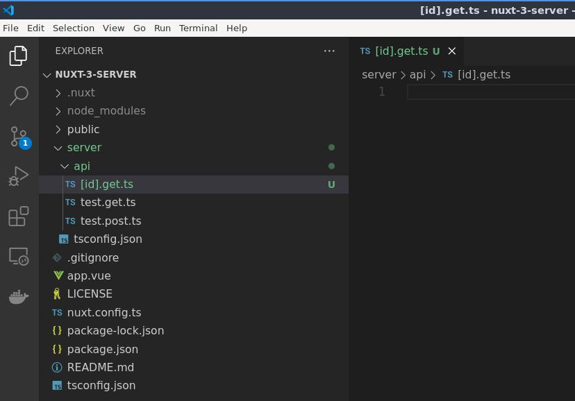
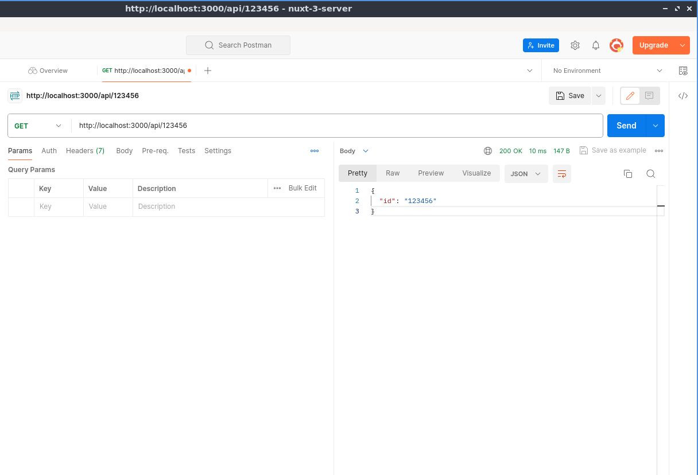
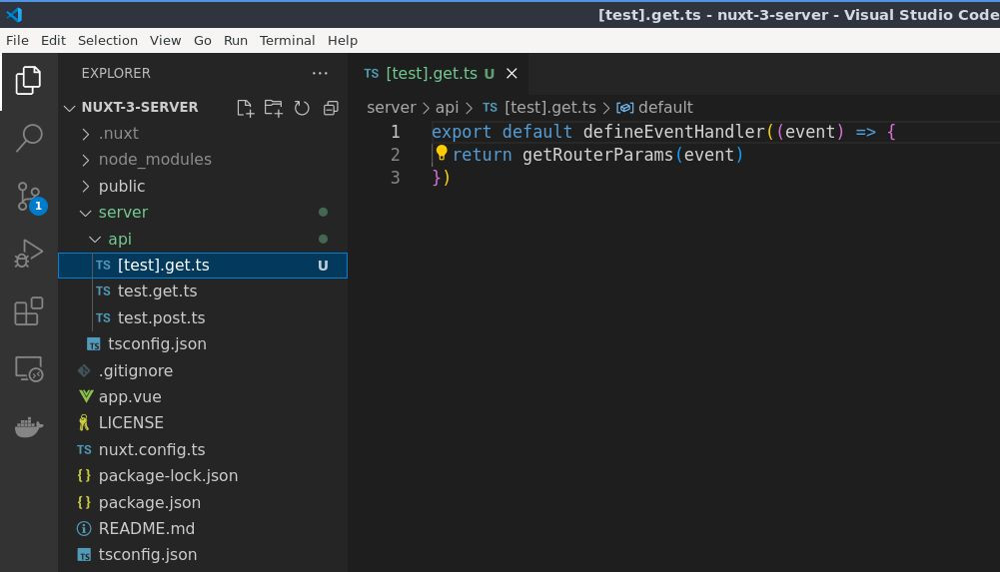
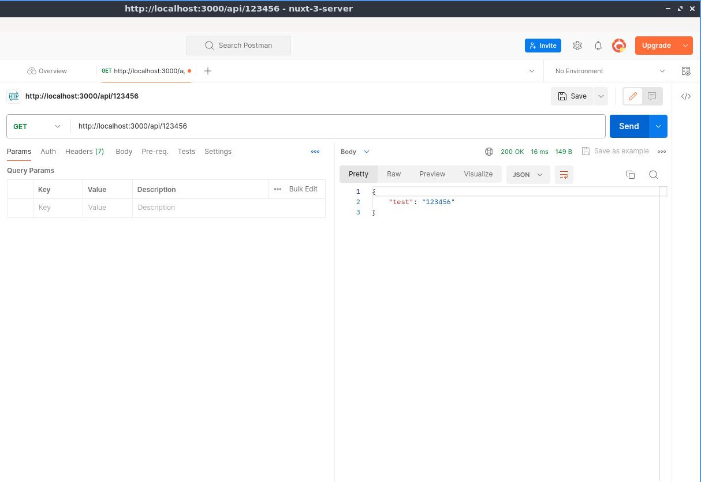
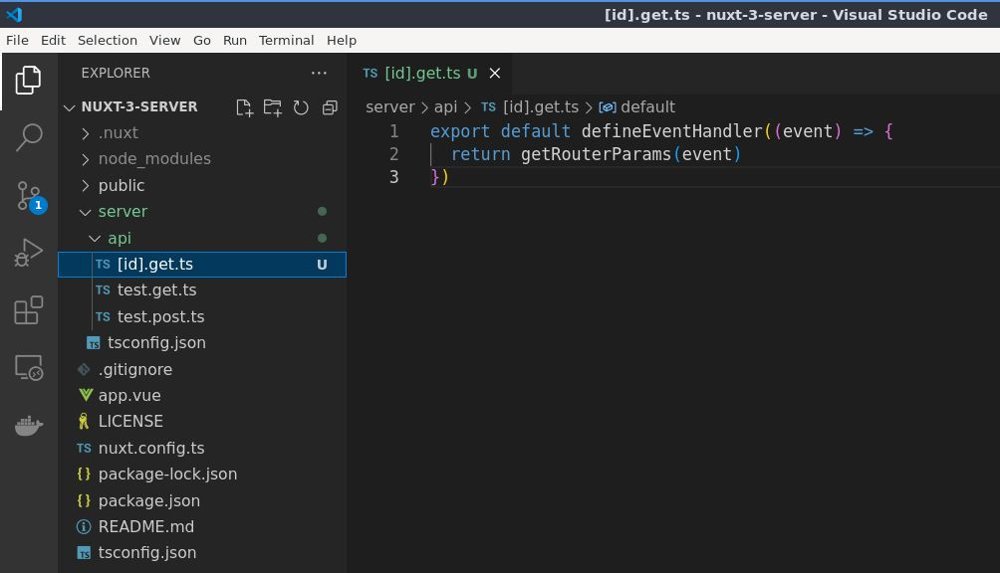
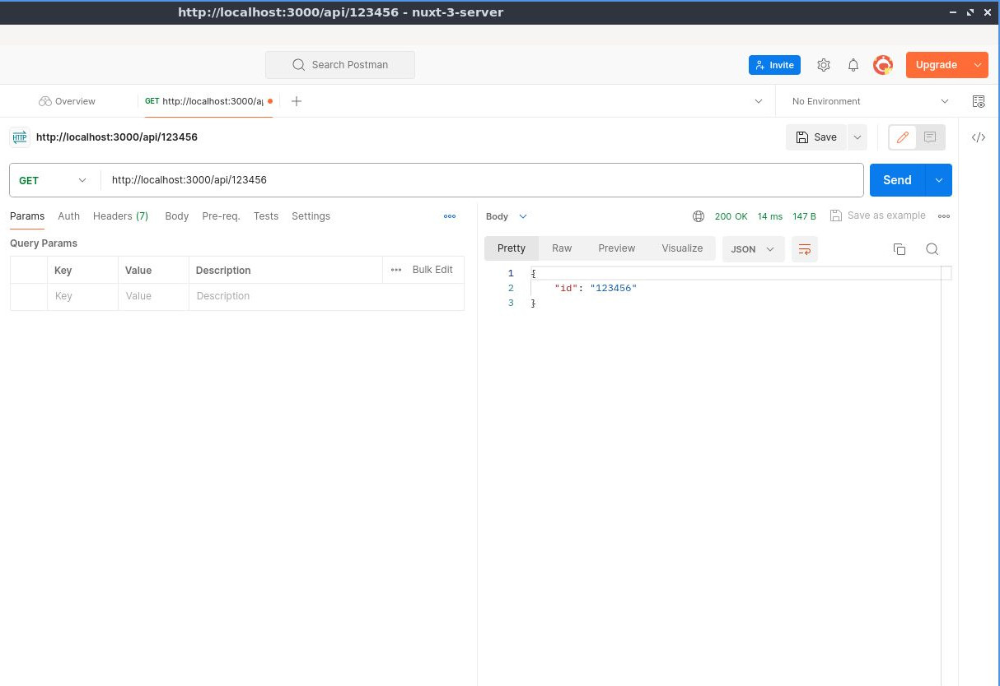
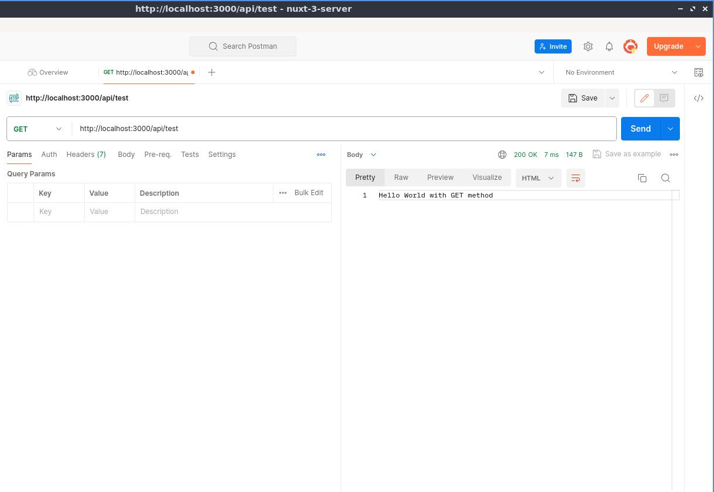

# Ruta Dinámica Básica de la API del Servidor

>Aprenda a crear una ruta API dinámica

Ahora comencemos a jugar con la ruta API del servidor dinámico

## Ruta Dinámica Básica
así que aquí en la carpeta `server` y dentro de la carpeta `api/`, creemos un nuevo archivo. Esa será la ruta API dinámica, así que entre corchetes y la identificación para que pueda nombrarlo como quieras. En mi caso usaré `id`, seguido de un método que `get` y el `.ts`.



Luego exportamos por defecto la función `defineEventHandler` pasando `event` como parametro y simplemente devolvemos `'Dinamic Route.'` y luego lo guardamos.


📃`./server/api/[id].get.js`
```ts
export default defineEventHandler((event) => {
  return 'Dinamic Route.'
})
```

Volvamos a Postman y cambiemos la prueba aquí a un valor diferente entonces `http://localhost:3000/api/123456` está bien por ahora. Luego envíalo y como puedes verlo
genera la ruta dinámica que es esta.


 

## Mostrar el Valor Dinámico
 
Así que regrese al código y si desea mostrar el valor dinámico como nuestro retorno, puede simplemente usar una de las utilidades de [**H3** que es `getRouterParams`](https://h3.unjs.io/utils/request#getrouterparamsevent-opts-decode), mandando `evento` como argumento.

📃`./server/api/[id].get.js`
```ts
export default defineEventHandler((event) => {
  return getRouterParams(event)
})
```

Vuelva Postman y luego al enviarlo puedes ver que genera `{"id": "123456"}`.



Ese `id` es desde nuestro nombre de archivo, así que si voy a cambiar eso a `test`.



Luego regresamos a Postman se convertirá en `test`.



Entonces volvamos a `id`.



Regresemos a Postman para probar.



Está bién, así es como se crea una ruta API dinámica básica.


## Aclaratoria

Es importante aclarar algo aquí, como podrá notar, tenemos aquí una ruta dinámica `api/123456` con el método `GET` y también tenemos la ruta `api/test` con el método `GET` disponibles. Por lo que quizás se pregunte si eso anulará la ruta `api/test`. La respuesta es no, ya que la ruta `api/test` está especificada, así que si vamos a cambiar eso para probarlo y luego enviarlo, eso devolverá `api/test`.


