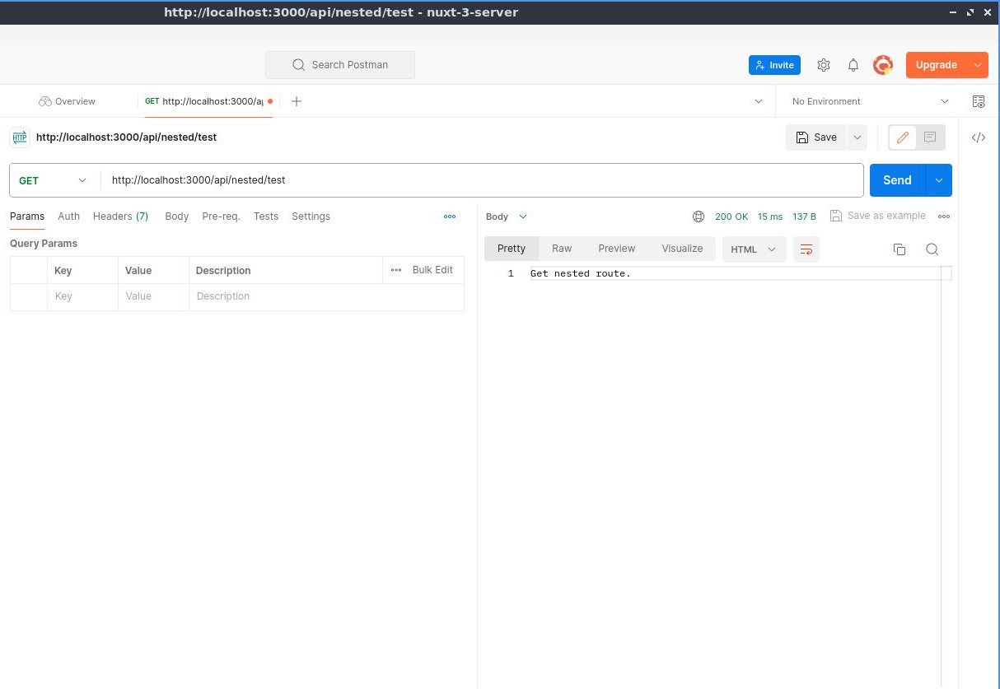
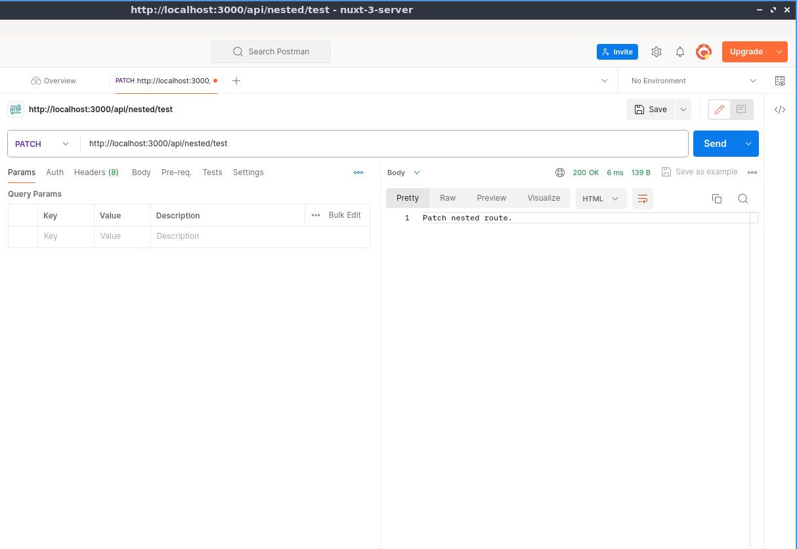
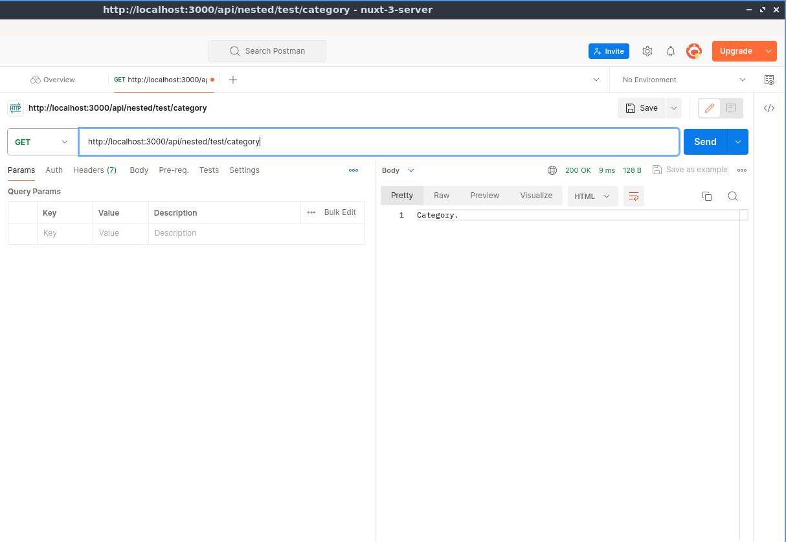

# Ruta Anidada Básica de la API del Servidor

## Aprenda a crear una ruta API anidada

>Ahora que sabemos cómo crear una [ruta API dinámica simple](./basic-dynamic-server-api-route.html), continúe con la ruta anidada.

En la carpeta `server/` y luego dentro de la carpeta `api/`, creemos una nueva carpeta que vamos a necesitar, llamémosla `nested/`, pero puede nombrarla como desee.


Entonces, dentro de la carpeta `nested/`, crearemos un archivo abriendo y cerrando corchete e introduciendo tres puntos así `[...]` dentro de ellos y luego la extensión del archivo que es `.ts`.


Luego aquí creemos un `router` con `createRouter`. Entonces llamaremos al `router` seguido del método _HTTP_, por lo que en nuestro ejemplo aquí es `get`. Pasaremos como primer parámetro `'/test'` y como segundo parámetro la función `defineEventHandler` con su correspondiente `event` como parametro y simplemente retornaremos `'Get nested route.'`. Finalmente exportemos por defecto `useBase()` pasando `'/api/nested'` como primer parámetro y luego el segundo parámetro será `router.handler`.

📃`./server/api/nested/[...].ts`
```ts
const router = createRouter()

router.get('/test', defineEventHandler((event) => {
    return 'Get nested route.'
}))

export default useBase('/api/nested', router.handler)
```

Así que guardemos el archivo y luego probaremos en Postman con la ruta `/api/nested/test` y esto regresará `Get nested route.`.





Y también si querías crear un método `post` aquí, por ejemplo, está bien. Entonces, creamos el `router.post`, digamos que usamos el mismo punto final de API, así que será `/test` luego el `defineEventHandler` con su correspondiente `event` como parametro y simplemente retornaremos `'Post nested route.'`


📃`./server/api/nested/[...].ts`
```ts{7,8,9}
const router = createRouter()

router.get('/test', defineEventHandler((event) => {
    return 'Get nested route.'
}))

router.post('/test', defineEventHandler((event) => {
    return 'Post nested route.'
}))

export default useBase('/api/nested', router.handler)
```

Así que guardemos el archivo y de vuelta a Postman con la misma ruta `"/api/nested/test"` pero ahora seleccionando el método `POST`, ahora esto regresará `Post nested route.`.


Lo mismo para `PUT`, `PATCH` y `DELETE`, así que veamos eso en acción. Copiemos esto y luego cambiémoslo para poner `put`, `patch` y `delete` respectivamente. También cambiemos el texto.

📃`./server/api/nested/[...].ts`
```ts
const router = createRouter()

// omitted for brevity ...

router.put('/test', defineEventHandler((event) => {
    return 'Put nested route.'
}))

router.patch('/test', defineEventHandler((event) => {
    return 'Patch nested route.'
}))

router.delete('/test', defineEventHandler((event) => {
    return 'Delete nested route.'
}))

export default useBase('/api/nested', router.handler)
```

Volvamos a Postman para probar uno a uno, empecemos con `PUT`.


Luego probemos con `PATCH`.



Finalmente el `DELETE`.


Si desea agregar otra ruta después, agreguemos aquí otro `router` y luego otro método HTTP, por ejemplo `get`, que será la ruta anidada `/api/nested/test/category`. Con su `defineEventHandler`, su correspondiente `event` como parametro y simplemente retornaremos `'Category.'`


📃`./server/api/nested/[...].ts`
```ts
const router = createRouter()

// omitted for brevity ...

router.get('/test/category', defineEventHandler((event) => {
    return 'Category.'
}))

export default useBase('/api/nested', router.handler)
```

Luego de vuelta a Postman, seleccionamos en este caso el método `GET`, y luego envía eso y eso generará la `'Category.'`





Lo mismo cosa cuando agregas otro punto final dentro o al lado de `api/test/category`, el mismo proceso. Así es como se crea un anidado básico de Rutas API del servidor.


