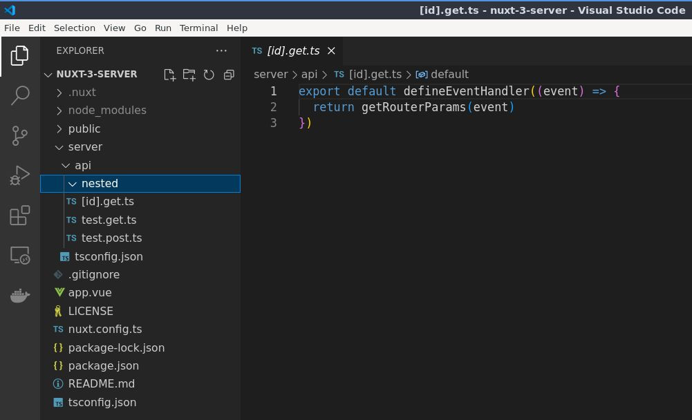
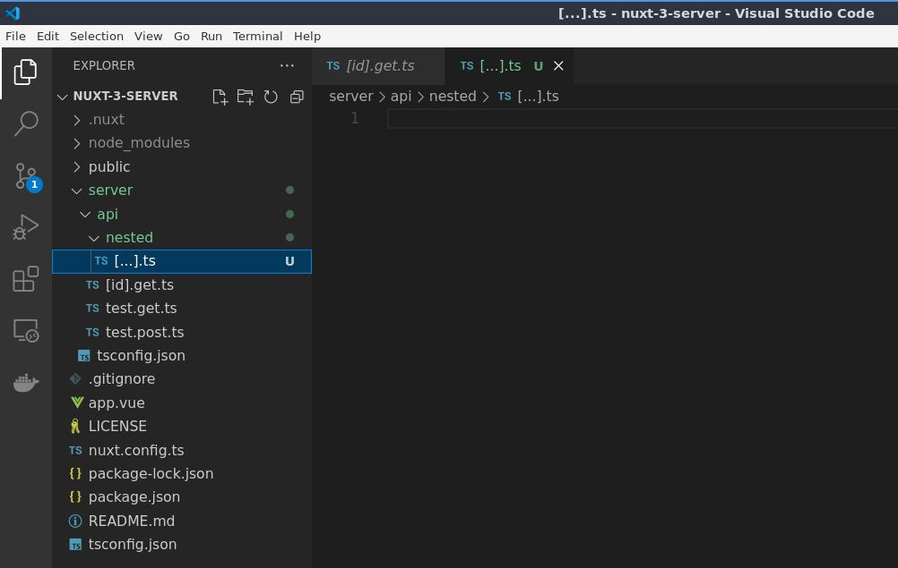

# Ruta Anidada Básica de la API del Servidor

## Aprenda a crear una ruta API anidada

>Ahora que sabemos cómo crear una [ruta API dinámica simple](./basic-dynamic-server-api-route.html), continúe con la ruta anidada.

En la carpeta `server/` y luego dentro de la carpeta `api/`, creemos una nueva carpeta que vamos a necesitar, llamémosla `nested/`, pero puede nombrarla como desee.

Entonces, dentro de la carpeta `nested/`, crearemos un archivo abriendo y cerrando corchete e introduciendo tres puntos `[...]` y luego el respectivo `.ts`.

Luego aquí creemos un enrutador para que con el enrutador, llamaremos al enrutador seguido del método um HTTP, por lo que en este caso o en nuestro ejemplo

aquí está `get` y luego um _slash_ y luego digamos `test`.

y luego el segundo parámetro será Definir controlador de eventos, está bien y luego

evento está bien así como así y luego simplemente regresemos aquí um prueba

ruta anidada bien y luego exportemos

predeterminado está bien uh predeterminado está bien y

luego usa base y esa será la um API

y luego la API anidada aquí y luego

um anidado y luego el segundo parámetro será um enrutador y luego Handler, está bien

Así y luego guardemos el archivo y luego abramos el cartero aquí.

Entonces um cambia eso a anidado y luego um

agreguemos también aquí las pruebas, entonces la prueba que creamos aquí, así que envíe

eso y eso generará la ruta listada de prueba, así que está aquí bien y si

También querías crear un método de publicación um aquí, por ejemplo, enrutador um y

entonces eso se publicará, está bien, entonces, la publicación del enrutador, por ejemplo, y luego, digamos

uh, digamos que usamos el mismo punto final de API, así que pruebe y luego

Defina el controlador de eventos y luego ese será un evento, está bien y luego

volver a publicar la ruta anidada, está bien, así que de vuelta en el uh

Cartero, así que en lugar de recibirlo, si voy a enviarlo, generará el

prueba la ruta anidada que es llegar aquí ya que nuestro método es obtener, pero si voy

para um seleccione publicar aquí y luego envíe que generará el resultado

uh, publique la ruta anidada, que es esta de aquí, está bien, lo mismo para um

poner y parchear, está bien, así que veamos eso en acción, así que enrutador, digamos poner y luego probar

En realidad, copiemos este bien y luego cambiémoslo para poner y luego

También cambiemos el texto uh, así que elimínelo o, en realidad, simplemente

Sólo um cambia este aquí para poner OK y luego lo mismo para um

borrar y luego um borrar bien y luego volver al

um cartero aquí, así que publique que generará la publicación enumerada

ruta, así que si voy a cambiar eso para ponerlo en salida, generará el put uh

ruta anidada y si voy a enviar un parche, esto no generará una salida

cualquier cosa, ya que no lo hicimos, no lo especificamos aquí, así que agreguemos eso también, está bien por el bien de esto, um.

tutorial para probar el parche y luego parchear bien y luego en el cartero

así que envíe eso y generará la ruta anidada del parche um, lo mismo

cosa para um eliminar, está bien, así que si desea agregar otra ruta después de la prueba

Así que agreguemos aquí otro enrutador y luego su método HTTP y eso.

será una prueba y luego digamos una categoría, ¿vale?

categoría y luego seguido por Definir controlador de eventos Controlador y luego el

evento está bien y luego volvamos aquí um

categoría bien simple y luego de vuelta en el

cartero y aquí, digamos cuál es el método aquí, así que consígalo después de la prueba.

categoría de barra diagonal, está bien y dado que nuestro método es get, cambiémoslo para obtener

está bien y luego envía eso y eso generará la categoría um aquí, está bien, lo mismo

cosa cuando agregas otro um otro punto final aquí dentro o al lado del

categoría, el mismo proceso, está bien, así es como se crea un anidado básico

Rutas API o API del servidor

8.42

Learn how to create a nested API route

okay now that we know how to create a simple um Dynamic API route let's

proceed with the um nested route okay so here in the server folder and then inside the API folder let's create a new

folder so um we're not going to um we're not going to need this one so let's just

create a new folder here so let's name it um nested okay but you can name it

whatever you want and then inside the nested folder open closing brackets and

Then followed by or inside inside it it's three dots okay and then the file

extension which is DS okay and then here let's create a router so con router and

that will be create router okay then after that let's call the router so

router and Then followed by the um HTTP method so in this case or in our example

here it's get and then um slash and then let's say um test okay

and then the second parameter will be the Define event handler okay and then

event okay just like that and then let's simply return here um test

nested route okay and then after that let's export

default okay uh default okay and

then use base and then that will be the um API

and then the nested here so API and then

um nested and then the second parameter will be um router and then Handler okay

just like that and then save the file and then let's um open the postman here

so um change that to nested and then um

let's also add here the tests so the test that we created here so so send

that and that will output the test listed route so that's here okay and if

you also wanted to create a um post method here so for example um router and

then that will be post okay so router post for example and then um let's say

uh let's let's say we use the same um API endpoint so test and then

Define event handler and then that will be an event okay and then

return post nested route okay so back in the uh

Postman so instead of get so if I'm going to send that that will output the

test nested route which is the get here since our method is get but if I'm going

to um select post here and then send that it will output output the

uh post nested route which is this one here okay so the same thing for the um

put and Patch okay so let's see that in action so router um let's say put and then test

let's actually just copy this one okay and then change that to put and then

let's also change the uh text as well so remove that or actually just let's

just um change this one here to put okay and then same thing for the um

delete and then um delete okay and then back in the

um Postman here so post that will output the post listed

route so if I'm going to change that to put it output it outputs the put uh

nested route and if I'm going to send patch this it's not going to um output

anything since we don't we didn't we didn't specify that here so let's also add that okay for the sake of this um

tutorial so patch test and then patch okay and then in the postman

so send that and it'll output it will output the um patch nested route so same

thing for the um delete okay so if you want to add another route after the test

so let's just um add here another router and then um your HTTP method and that

will be um test and then um let's say a category okay

category and Then followed by the Define event handler Handler and then the

event okay and then let's return here um

category okay simple and then back in the

postman and here let's um what's the method here so get so after the test

slash category okay and since our method there is get let's change that to get

okay and then send that and that will output the um category here okay so same

thing when you add another um another end point here inside or next to the

category just the same process okay so that's how you um create a basic nested

API routes or server API
