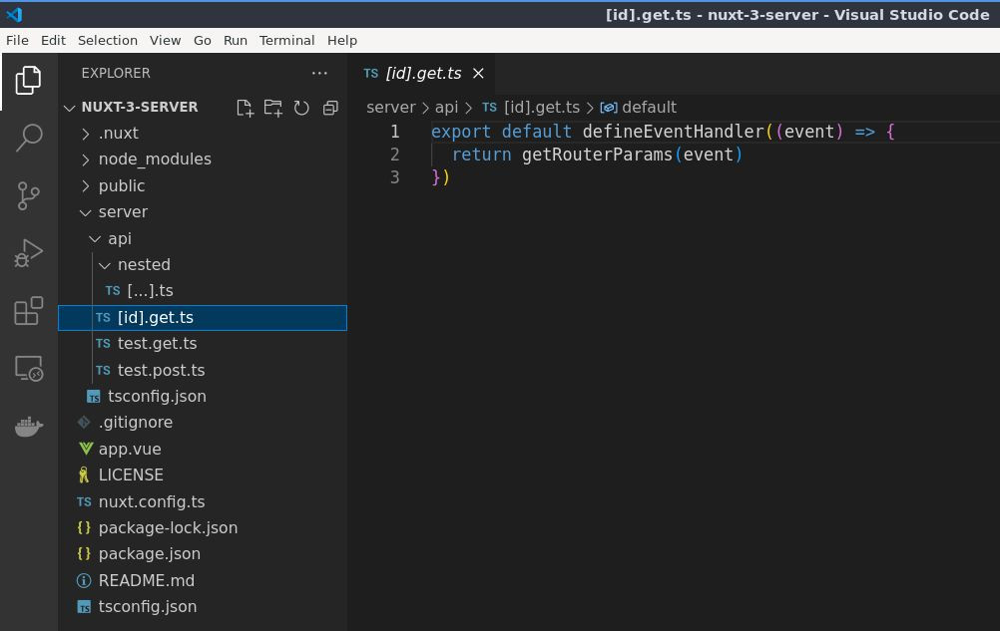
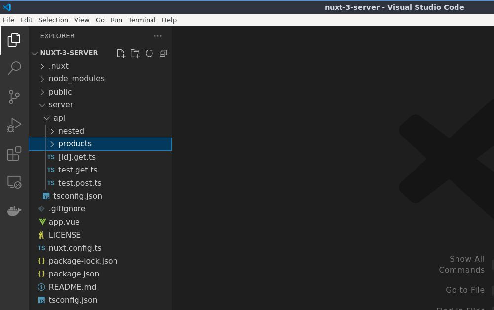
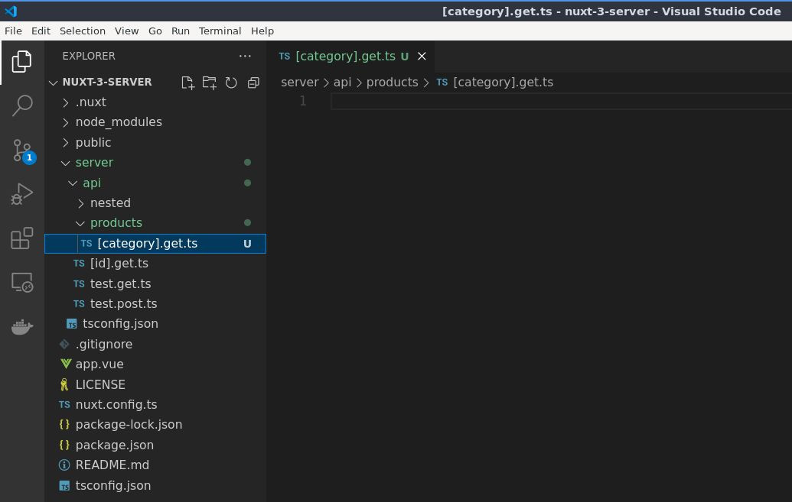
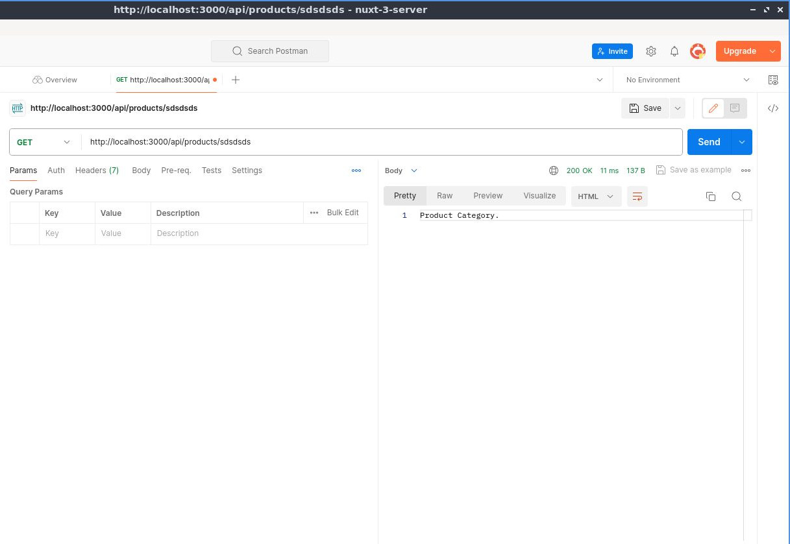

# Ruta Dinámica Anidada de la API del Servidor

## Aprenda a crear una ruta API anidada dinámica

Ahora que sabemos cómo crear rutas API anidadas simples, intentemos crear rutas API dinámicas anidadas. Será algo como [esto](./basic-dynamic-server-api-route.html), solo que estará anidado.




Pero antes, una nota rápida sobre esto. En la [documentación oficial de Nuxt](https://nuxt.com/docs/guide/directory-structure/server#server-routes) dice lo siguiente:

:::info
Tenga en cuenta que actualmente las rutas del servidor no admiten la funcionalidad completa de las rutas dinámicas como lo hacen las páginas.
:::

Durante la prueba, realmente funciona. Pero no sugeriría que uses esto en el tus proyectos del mundo real. Estamos seguro de que en el futuro admitirán rutas API dinámicas, así que realmente, vamos a probarlo.

Aquí en la carpeta `api/` creemos una nueva carpeta, digamos por ejemplo, que tenemos productos, así que será `products/`.



Luego dentro de la carpeta `products/`, creemos un nuevo archivo que será una categoría dinámica. Entonces será `[category]` seguido de un método HTTP más la extensión `.ts`.




Entonces exporte el valor predeterminado `defineEventHandler` el controlador de eventos y luego el evento. Y entonces simplemente regresemos categoría de producto.


📃`./server/api/products/[category].get.ts`
```ts
export default defineEventHandler((event) => {
  return 'Product Category.'
})
```

Y luego veamos eso en acción con Postman enviando `/api/products/sdsdsds`.




, así que aquí, um, eliminemos eso, uh, realmente eliminemos

hasta que la API esté bien, entonces los productos y luego el nombre dinámico de la categoría um están bien, entonces

categoría de producto está bien y luego um para crear rutas dinámicas uh anidadas.

um crea una nueva carpeta y esa será una categoría, está bien, entonces

Categoría, está bien, así, muy similar a esta, la única diferencia es um

este es un archivo y esta es una carpeta, está bien, dentro de una categoría o dentro de una dinámica

carpeta de categoría, creemos un nuevo archivo y ese será un ID de producto y luego seguido de un

um un método que es obtener. DS está bien entonces

exportar valor predeterminado Definir controlador de eventos y luego

evento correcto y luego um ID de producto correcto

Está bien, entonces vamos a probar eso, así que aquí, ya que este es nuestro um.

categoría de producto como puede ver si envío que esta es nuestra categoría de producto um, pero si voy a agregar um

otra barra o barra diagonal allí para que active la ID del producto um aquí

que también es dinámico, por ejemplo, un 123 que generará el ID del producto

¿Cuál es este aquí? Para verlo en acción, si realmente es así.

trabajando así que regresemos y obtengamos una solicitud

solicitar parámetros Creo que um parámetros un enrutador está bien y luego

evento y luego guárdelo y luego en el cartero enviemos eso y será

genere la categoría um aquí, cuál es esta y luego el ID del producto que

¿Está bien este de aquí y si vamos a um solo la categoría aquí, así será?

genera la categoría de producto, así que si vas a intentar generar los parámetros para que

Por ejemplo, aquí debería generar solo los parámetros de categoría um, así que volvamos

al ID del producto um, así que uh 1 2 3 4, está bien

y luego muestra el nombre de la categoría para que la categoría sea un valor de categoría, está bien

entonces categoría y luego valor de categoría y luego ID de producto, ese es 1 2 3 4, está bien

entonces la categoría aquí será um, esa es la carpeta de categorías um aquí o

y luego el archivo de categoría uh y luego el ID del producto que será el ID del producto dinámico aquí, está bien, para que

funcionará igual con uh post y estará bien, así que probémoslo, así que si

Voy a cambiar eso a

publicar bien y luego cambiar eso a

publicar y luego funcionará igual, así que lo mismo para los demás también, así que coloque el parche y elimine, está bien, así que

Espero que tenga sentido y déjame saber si tienes alguna sugerencia o pregunta sobre este, ya que creo que es KNX.

KNX no verifica esto, pero creo que estoy seguro de que lo harán en el futuro.

14:45m

Learn how to create a dynamic nested API route

routes and now that we know how to create a simple nested API routes let's

try to create a um Dynamic API routes okay so that will be something something

like this only it is nested okay so just a quick note on this one um here in kn.

viw or in KNX website it says here that note that current currently server routes does not support full does not

support the full functionality of the dynamic routes as Pages do okay but

during the test it actually works but I wouldn't suggest um using this in the in

your um real world uh projects okay and I'm sure in the future they will support a Dynamic API routes okay so let's

actually test that so here um in the um API so in the API folder let's create a

new folder so um let's say for example we have a products so that will be uh

products and then inside the uh products folder let's create a new file and that

will be um a dynamic category okay so category and Then followed by

a um HTTP method so get. DS okay so

export default Define event handler and then event okay just like that and then

let's just simply return here um product category okay and then let's uh see that

in action so here um remove that uh let's actually remove

until the API okay so products and then the dynamic um category name okay so

product category okay and then um to create a nested uh Dynamic routes let's

um create a new folder and that will be um category okay so

Cate gory okay just like that so similar to this one the only difference is um

this is a file and this is a folder okay so inside a category or inside a dynamic

category folder let's create a new file and that will be a um product ID and Then followed by a

um a method so which is get. DS okay so

export default Define event handler and then

event okay and then um product ID okay

okay so um let's actually um test that so here um since since this is our um

product category as you can see if I send that this is our um product category but if I'm going to add um

another slash or forward slash there so that will trigger the um product ID here

which is also a dynamic so for example one 123 that will output the product ID

which is this one here um to actually see that in action if it's actually

working so let's um return get um request

request params I think um params a router params okay and then

event and then save that and then in the postman let's send that and it will

output the um category here so which is this one and then the product ID which

is this one here okay and if we go to the um just the category here so it it will

output the product category so if you're going to try to um output the params so

example here it should output only the um category params okay so let's go back

to the um product ID so uh 1 2 3 4 okay

and then sample category name so category it's um category value okay

so category and then category value and then product ID that's the 1 2 3 4 okay

so the category here that will be um that's the um category folder here or

and then the category uh file and then the product ID that will be the uh Dynamic product ID here okay so that

will work the same with uh post and get okay so let's actually test that so if

I'm going to uh change that to

post okay and then change that to

post and then that will work the same okay so same thing for the others as well so put patch and delete okay so I

hope that makes sense and um let me know if you have any suggestions or questions about this one since it I think KNX um

this is not verified by KNX okay but I think I'm sure they will do that in the future
