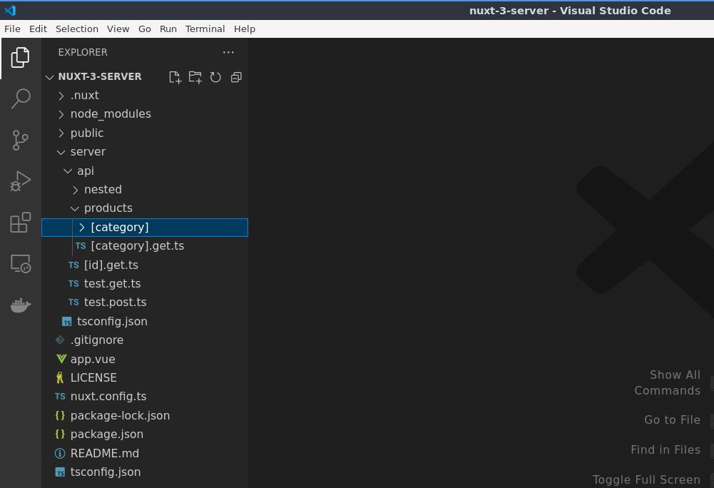
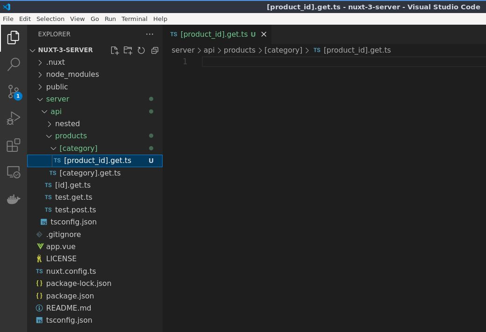
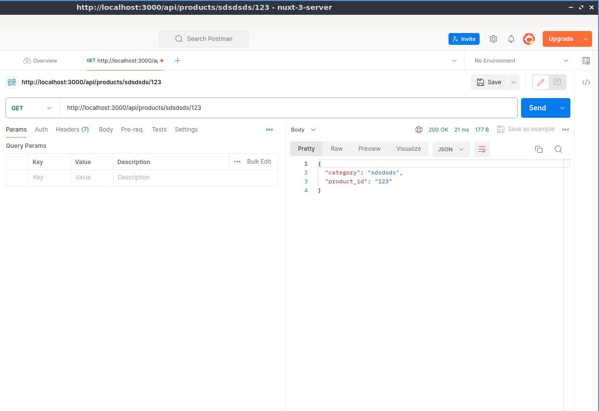
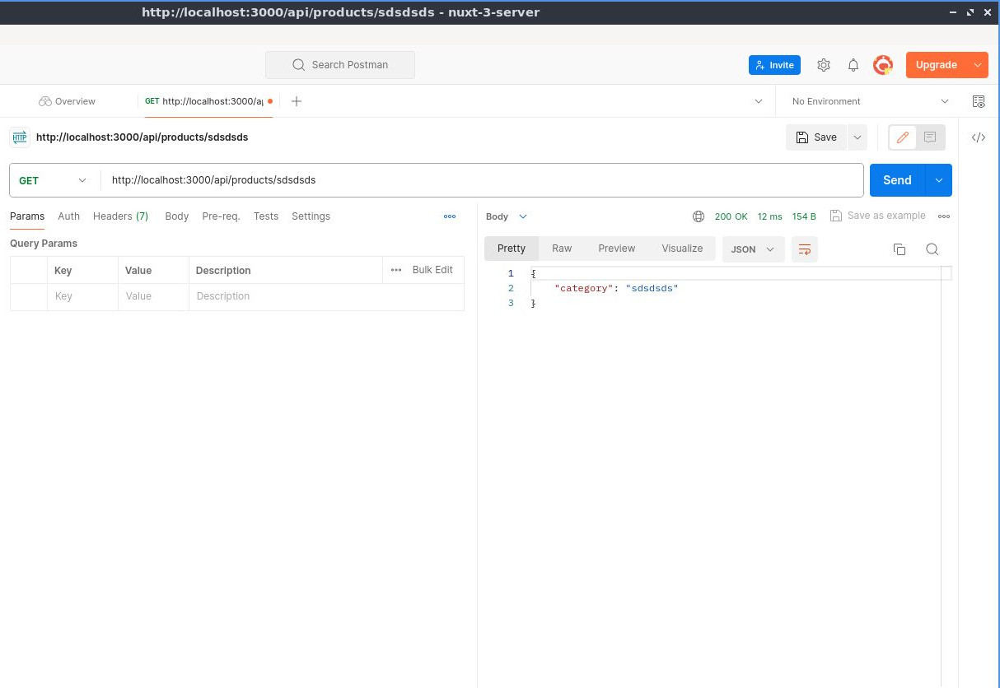
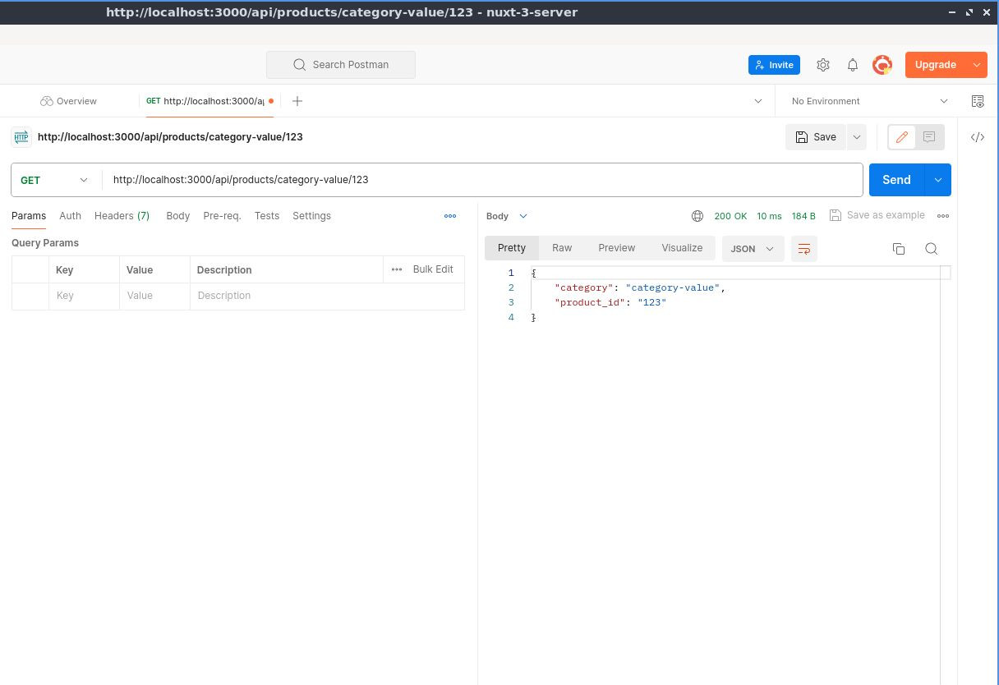
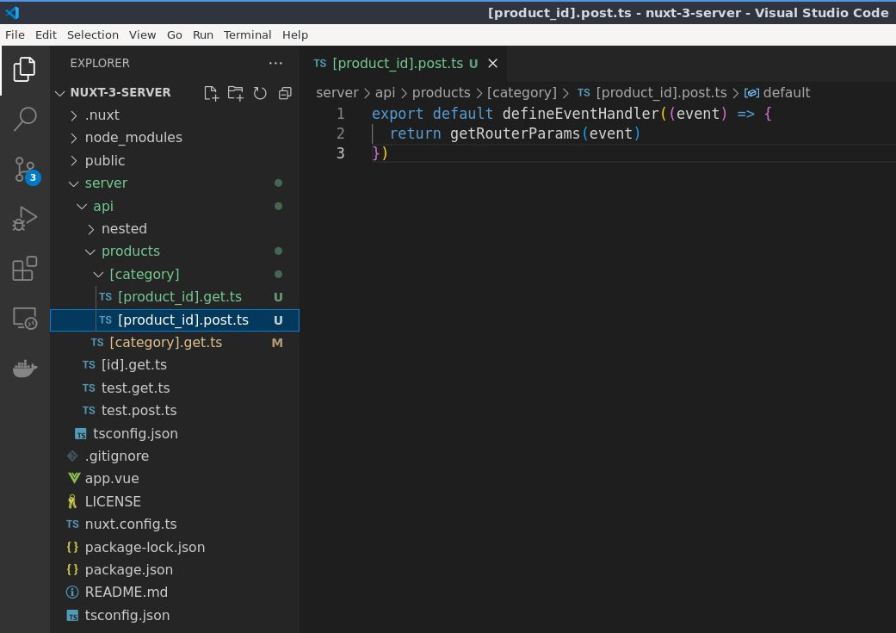

# Ruta Dinámica Anidada de la API del Servidor

## Aprenda a crear una ruta API anidada dinámica

Ahora que sabemos cómo crear rutas API anidadas simples, intentemos crear rutas API dinámicas anidadas. Será algo como [esto](./basic-dynamic-server-api-route.html), solo que estará anidado.


Pero antes, una nota rápida sobre esto. En la [documentación oficial de Nuxt](https://nuxt.com/docs/guide/directory-structure/server#server-routes) dice lo siguiente:

:::info
Tenga en cuenta que actualmente las rutas del servidor no admiten la funcionalidad completa de las rutas dinámicas como lo hacen las páginas.
:::

Durante la prueba, realmente funciona. Pero no sugeriría que uses esto en el tus proyectos del mundo real. Estamos seguro de que en el futuro admitirán rutas API dinámicas, así que realmente, vamos a probarlo.

En la carpeta `api/` creemos una nueva carpeta, digamos por ejemplo, que tenemos productos, así que será `products/`.


## Crear archivo dinámico

Luego dentro de la carpeta `products/`, creemos un nuevo archivo que será una categoría dinámica. Entonces será `[category]` seguido de un método HTTP más la extensión `.ts`.


Entonces, dentro de este archivo exporte el valor predeterminado `defineEventHandler` pasando `event` como parametro. Y luego simplemente regresemos `'Product Category.'`.


📃`./server/api/products/[category].get.ts`
```ts
export default defineEventHandler((event) => {
  return 'Product Category.'
})
```

Depués veamos eso en acción con Postman enviando `/api/products/sdsdsds`. Esto viene siendo los productos y luego el nombre dinámico de la categoría.


## Crear carpeta dinámica anidada.

Crearemos una nueva carpeta la cual será una categoría, entonces llamarla `[category]`, está bien así. Muy similar a el archivo `[category].get.ts`, la única diferencia es que este es un archivo y `[category]` es una carpeta.



## Crear archivo dinámica anidado dentro de carpeta dinámica.

Dentro de la carpeta dinámica `[category]/`, creemos un nuevo archivo dinámico llamado `[product_id]` seguido de un método `get` y `ts` como extensión.



Entonces, dentro de este archivo exporte el valor predeterminado `defineEventHandler` pasando `event` como parametro. Y luego simplemente regresemos `'Product ID.'`.

📃`./server/api/products/[category]/[product_id].get.ts`
```ts
export default defineEventHandler((event) => {
  return 'Product ID.'
})
```

Ahora vamos a probar esto para ver en acción si realmente es así, así que vamos a Postman.

Agregaremos otra barra diagonal para que active el ID del producto que también es dinámico, por ejemplo, `/api/products/sdsdsds/123` generará `'Product ID.'`.

  


Para ver en acción si realmente está trabajando, obtengamos los parámetros del enrutador con la función `getRouterParams`.

📃`./server/api/products/[category]/[product_id].get.ts`
```ts
export default defineEventHandler((event) => {
    return getRouterParams(event)
})
```

Luego guárdelo y pruebe en Postman enviando esto que generará la categoría `sdsdsds` y el ID del producto `123`.



## Corroborando la funcionalidad anterior

Probemos con `/api/products/sdsdsds` para corroborar que está funcionando [el punto anterior](./dynamic-nested-server-api-route.html#crear-archivo-dinamico).


Si intentamos que genere los parámetros de la categoría del producto obteniendo los parámetros del enrutador con la función `getRouterParams`.

📃`./server/api/products/[category].get.ts`
```ts
export default defineEventHandler((event) => {
  return getRouterParams(event)
})
```

Ahora esta ruta debería generar solo los parámetros de la categoría, así que volvamos a Postman y vamos a la acción.




Hagamos otra prueba con la ruta `/api/products/category-value/1234`.



Entonces nos devolverá la caregoría `category-value` y el ID del producto `1234`. Lo que quiere decir que esto está funcionando bien.

## Probando otro método

Funcionará igual con el método `post`, así que vamos a probarlo.

Copiemos y peguemos en la misma carpeta `./server/api/products/[category]/` el archivo `[product_id].get.ts` renombrándolo como `[product_id].post.ts`.





Recuerde cambiar en Postman el método a `POST` antes de enviar y todo funcionará igual.


Así que lo mismo para `put`, `patch` y `delete`. 

:::info
Creemos que hasta ahora Nuxt no ha verificado esto, pero estamos seguro de que lo harán a futuro inmediato.
:::

