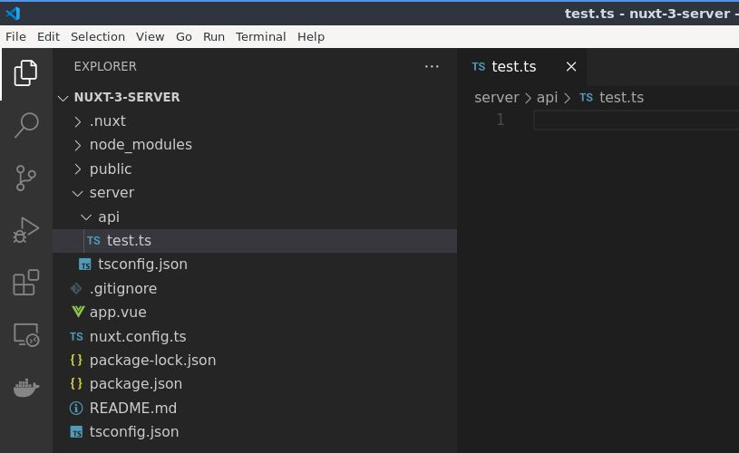
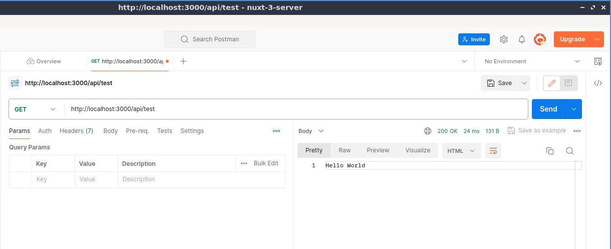
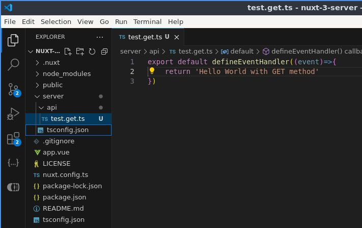
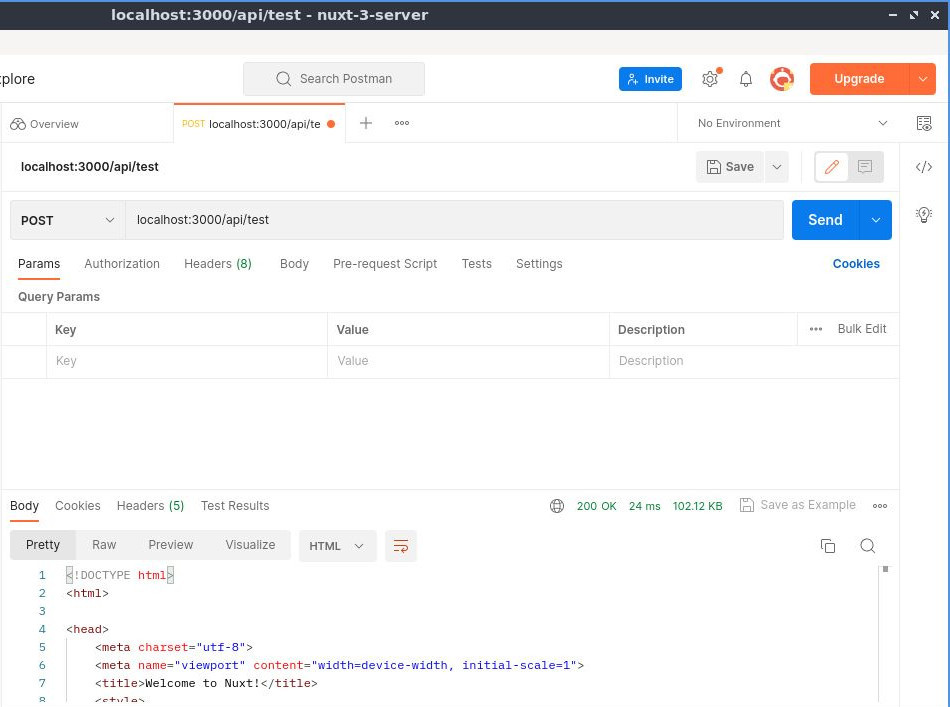
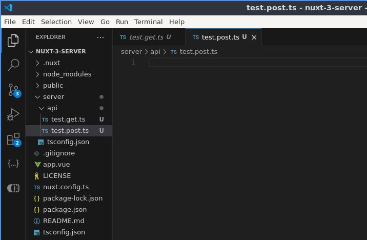
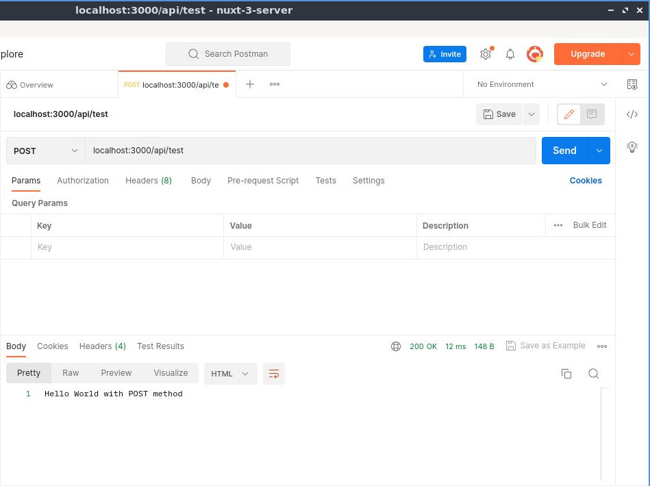
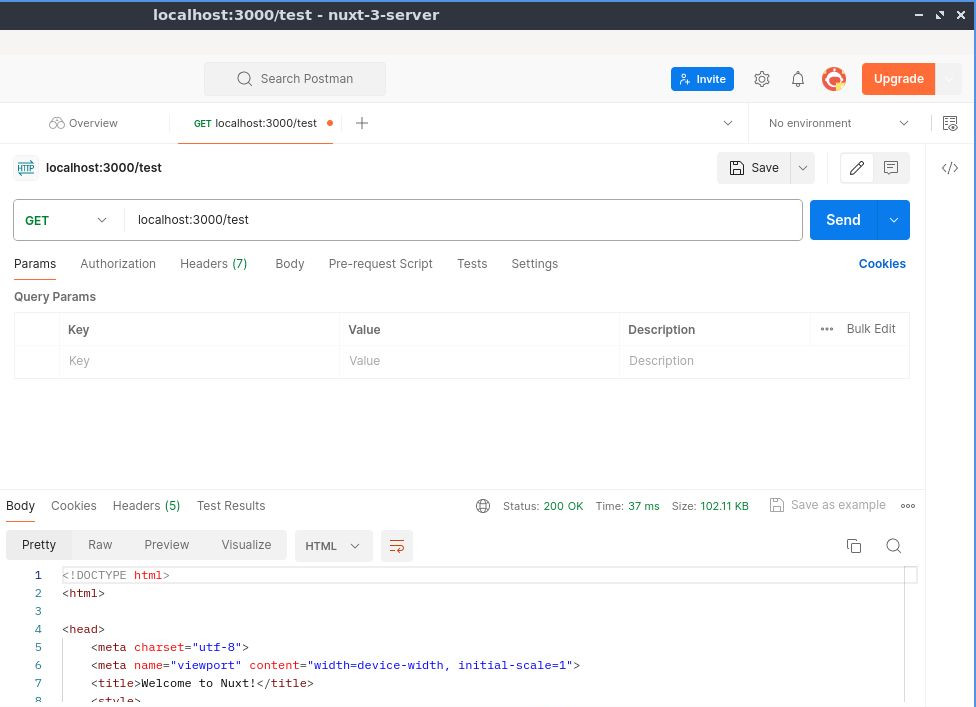
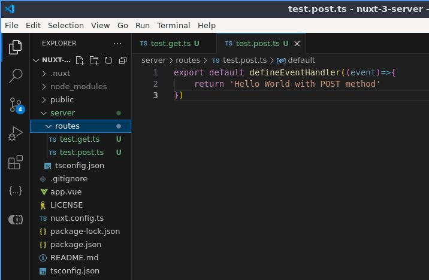
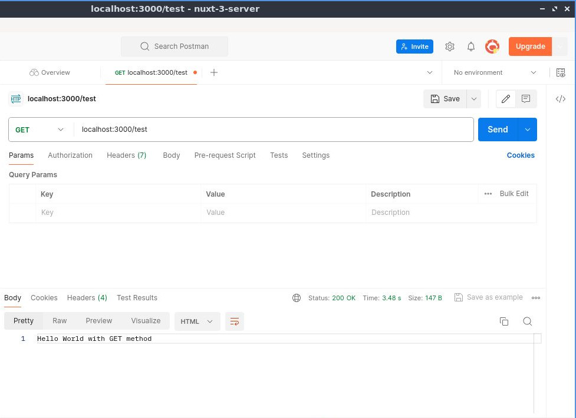
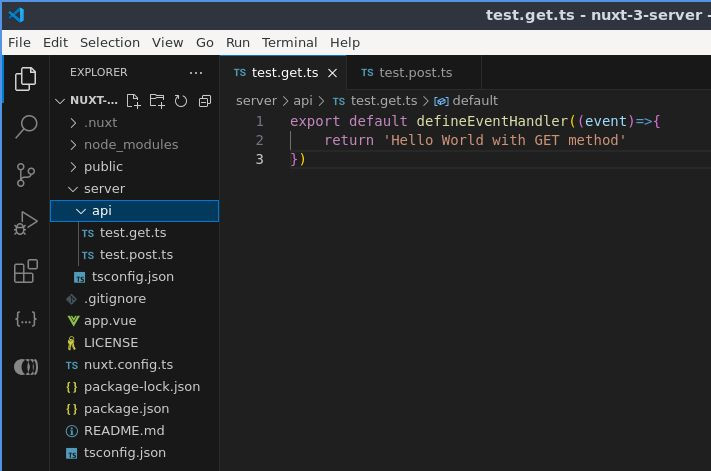

# Ruta Básica de la API del Servidor

> Aprenda los conceptos básicos de la API de Nuxt

## Creando una API

Comencemos creando una API en la carpeta de `server/`. Cree una nueva carpeta y llamémosla `api/`. Luego, dentro de esta carpeta, cree un nuevo archivo y llamémoslo `test.ts`.



Luego dentro del archivo `test.ts` exportar predeterminadamente el método `defineEventHandler` pasando como argumento una función de flecha que a su vez recibe el parametro `event` y simplemente regresaremos `'Hello World'`.

📃`./server/api/test.js`
```ts
export default defineEventHandler((event)=>{
  return 'Hello World'
})
```

Luego guarde el archivo y diríjase a Postman, llamemos desde la url `http://localhost:3000/api/test` y pruebe.



Como puede ver, genera el  `'Hello World'`.

## Establecer un método HTTP específico

Si quieres establecer un método HTTP específico en la API de tu servidor, simplemente puede solucionarlo con el método que desea, así que cámbiele el nombre al archivo, por ejemplo, `test.get.ts`. Por lo que esto se convertirá automáticamente en un controlador `GET`.



📃`./server/api/test.get.js`
```ts
export default defineEventHandler((event)=>{
  return 'Hello World with GET method'
})
```

Volvamos al cartero y si lo enviamos, generará el `'Hello World'`, está bien, pero si vamos a cambiar el método a `POST` enviar eso ya no funcionará ya que este es el controlador `GET`.



Está bien, pero si quieres cambiar el método de la API a `POST`, puedes cambiar el nombre nuevamente o crear otra prueba. Cree un archivo `test.post.ts`.



📃`./server/api/test.post.js`
```ts
export default defineEventHandler((event)=>{
  return 'Hello World with POST method'
})
```

Vamos a Postman, envíalo y funcionará.




Así que lo mismo para `PUT`, `PATCH` y `DELETE`. Si quiere obtener más información al respecto [consulte la documentación oficial](https://nuxt.com/docs/guide/directory-structure/server#matching-http-method).


## Si no utiliza la palabra `api`

En caso de que no desee utilizar la palabra `api` en las rutas de su servidor, por ejemplo, si desea eliminar la palabra `api` y simplemente
llamar al nombre del archivo de la API, ya no funcionará.



Así que necesitará cambiar el nombre de `api` a `routes`.




Luego regrese a Postman y si lo intentas nuevamente, envíelo y, como puede ver, genera `Hello World` sin el prefijo `api`.



Así que esto es opcional, pero el uso común aquí es `host` y luego, seguido del nombre de `api`. Así que voy a cambiarlo de nuevo a `api`, ya que gusta más así.



Luego de vuelta en Postman, envíelo y funcionará de nuevo.


