# Middleware de Servidor

>Ahora que hemos terminado de trabajar con los puntos finales de la API del servidor, exploremos el middleware del servidor.

## Conceptos básicos del middleware del servidor

Cerremos la carpeta `api/` por ahora y luego en la carpeta `server/`, haga clic derecho y luego crear nueva carpeta. Llamémosla `middleware/`, aquí leerá automáticamente cualquier archivo dentro de esta carpeta y se leerá como un middleware de servidor.

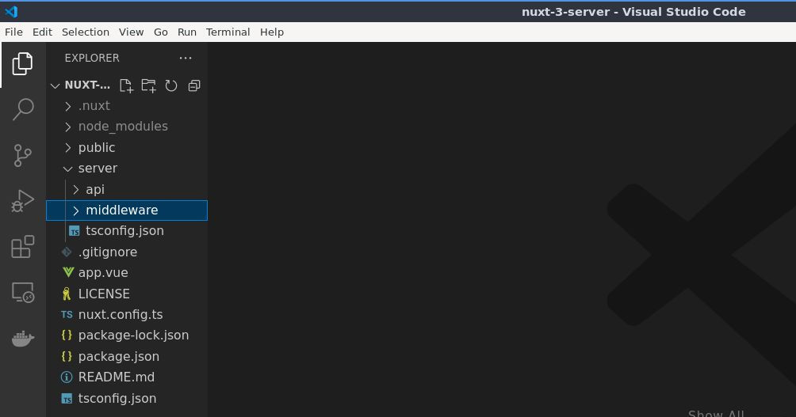

A continuación creemos un nuevo archivo llamado `log.ts`.

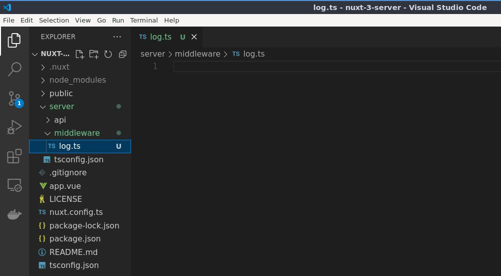

Por cierto, puedes nombrar este archivo aquí como quieras. En mi caso es un registro de consola en este ejemplo Y también observe

que no estamos estamos añadiendo ningún tipo de sufijo relacionado con métodos HTTP porque o lo necesitamos en el middleware.

Entonces, aquí en el archivo el mismo proceso. 


21:11


```ts
export default defineEventHandler((event) => {
  console.log('Middleware')
})
```


---


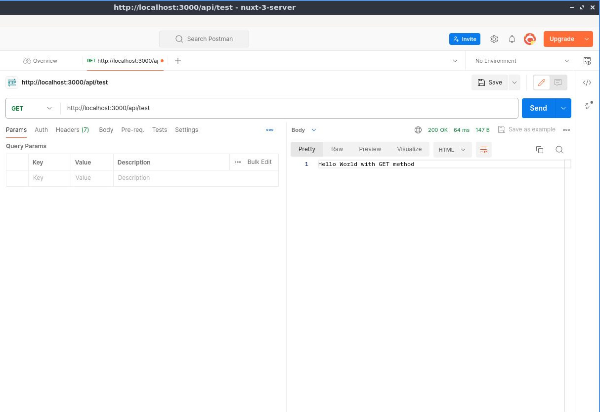

---


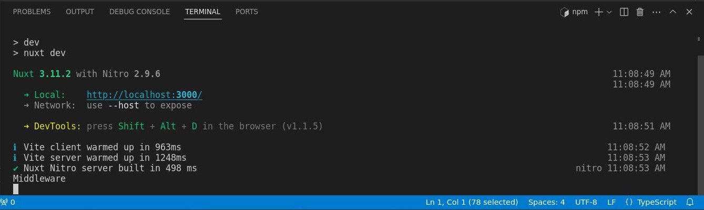

---

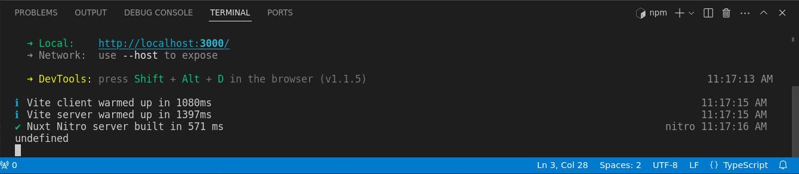

---

```ts
export default defineEventHandler((event) => {
  const authorization = getRequestHeader(event, 'authorization')
  if (authorization) {
    event.context.autorized = true
  } else {
    event.context.autorized = false
  }
})
```

---

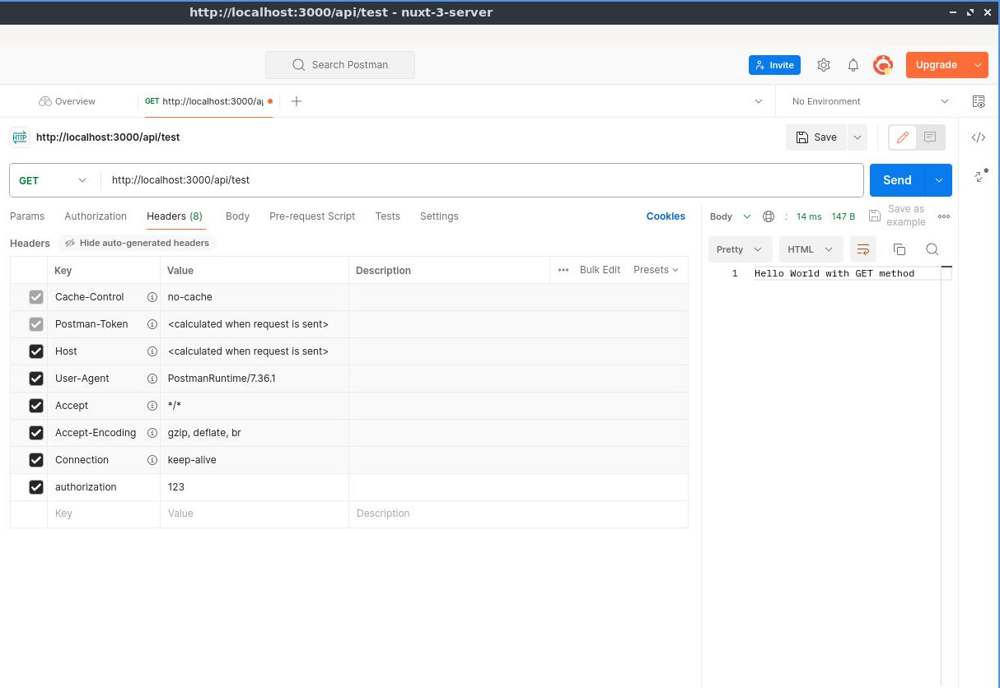

---

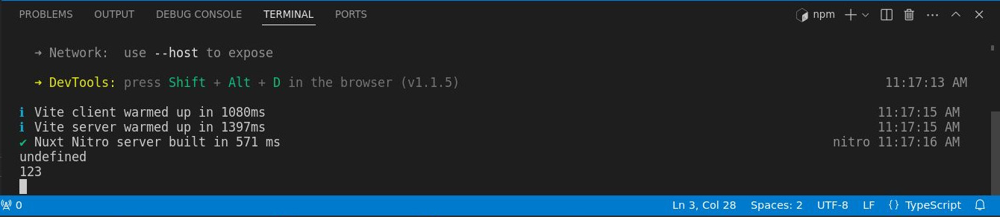

---

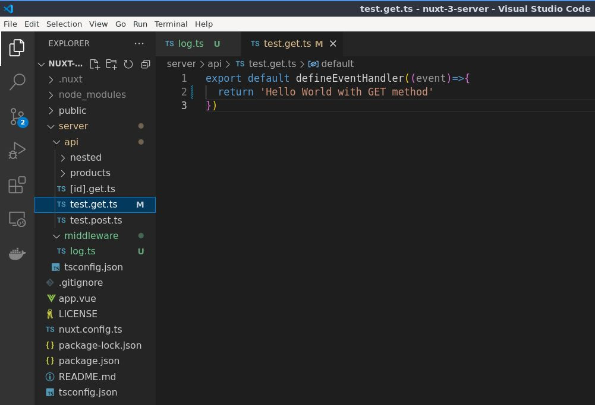

---

`test.get.ts`
```ts
export default defineEventHandler((event)=>{
  console.log(event.context.autorized)
  return 'Hello World with GET method'
})
```

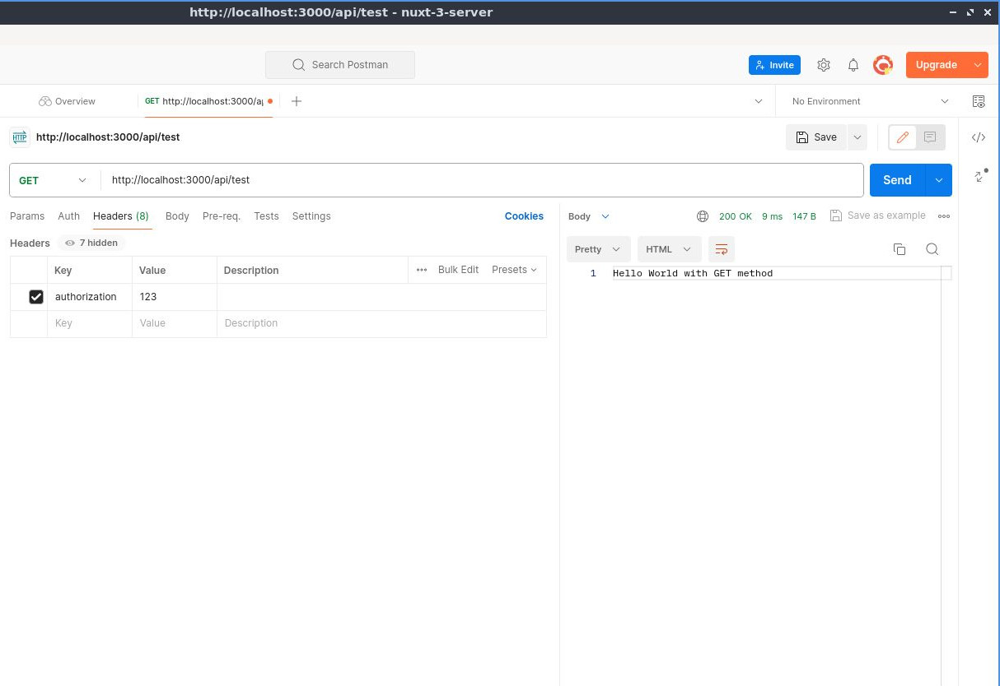

---

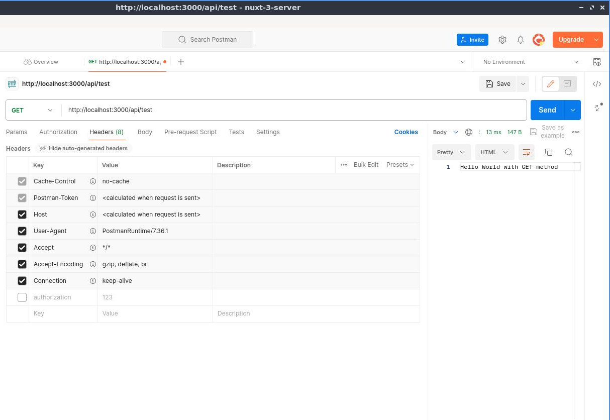

---

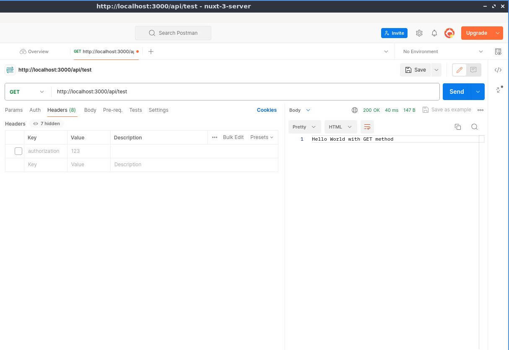

---

```ts
export default defineEventHandler((event)=>{
  if (!event.context.autorized) {
    return createError({statusCode:401, statusMessage: 'Unauthorized'})
  }
  return 'Hello World with GET method'
})
```
---

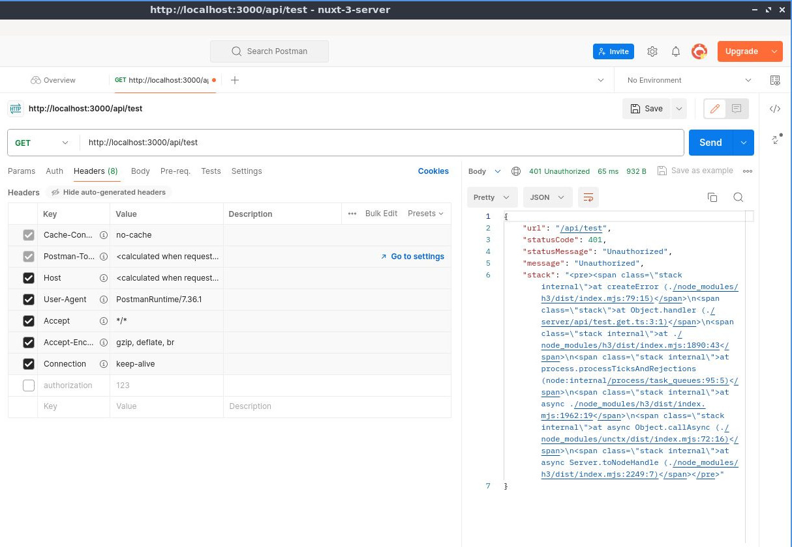

---

```ts
export default defineEventHandler((event)=>{
  console.log(event.context.autorized)  
  return 'Hello World with GET method'
})
```

---

```ts
export default defineEventHandler((event) => {
  const authorization = getRequestHeader(event, 'authorization')
  if (authorization) {
    event.context.autorized = true
  } else {
    throw createError({statusCode:401, statusMessage: 'Unauthorized'})
  }
})
```

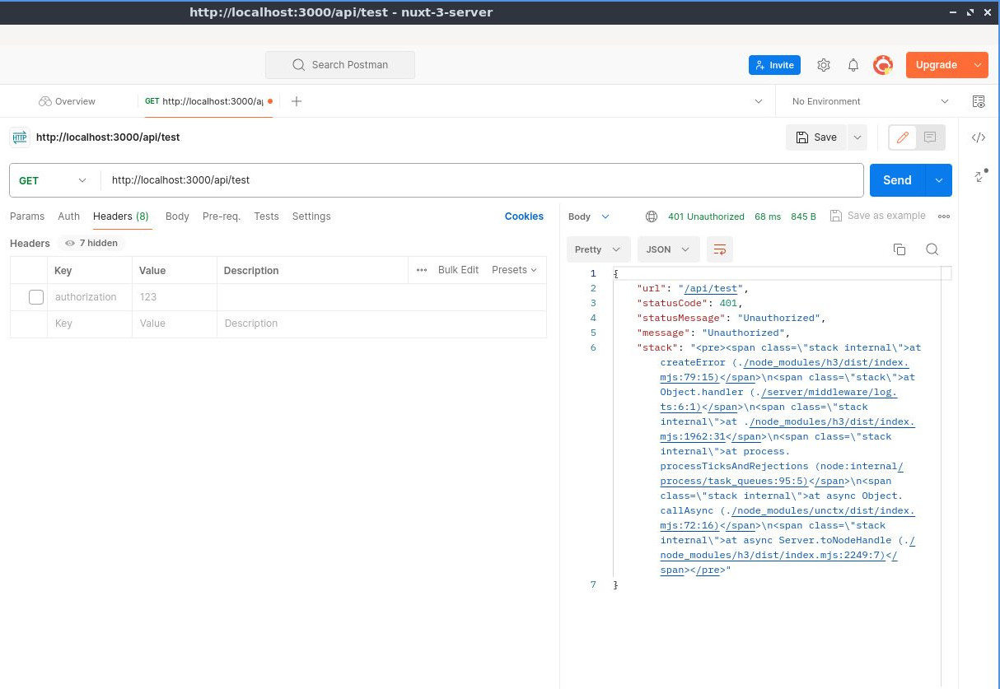


Entonces, en realidad, generemos el siguiente controlador de eventos.

Así de fácil, así que exporta el valor predeterminado. Definir el controlador de eventos. Está bien y luego consolaremos.

registrar el middleware, está bien, así como así y luego abrir el cartero o, en realidad, vamos

Abra primero la terminal um aquí y luego déjeme borrar eso y luego abra el

cartero y luego, si recuerdas, esta es la primera API que creamos.

um, devolverá el um hola mundo, está bien, así que enviemos eso y como tú

Puedo ver que genera el middleware um aquí, que es este aquí, está bien, así que solo

Una nota importante: el middleware se ejecutará primero antes de llegar a cualquier API.

El middleware es útil si, por ejemplo, estás haciendo algunas validaciones o um.

registrar cualquier solicitud o extender los eventos está bien, así que veamos

eso en acción, así que, por ejemplo, aquí vamos a ejecutar una validación simple si la autorización

existe, así que en el punto final de la API, así que aquí, simplemente eliminemos eso y luego

con autorización y luego usaremos una utilidad H3 que es um get

um, ¿cómo se llama? um obtener encabezado de solicitud, está bien, obtener solicitud

encabezado y luego el primer parámetro será el evento um y luego el segundo

El parámetro será el um um, el valor del encabezado um, está bien, y ese será el

autorización, así que si puede usar una A mayúscula o una pequeña, eso funcionará

lo mismo y luego guárdelo y luego registremos la consola por ahora, ¿está bien?

autorización está bien así, así que no estamos haciendo ninguna validación por ahora, solo estamos registrando la consola um

autorización, está bien, así que abramos la terminal aquí y luego aclaremos

eso y luego de vuelta al cartero y luego um, enviemos la API y como quieras

Puede ver que, como se esperaba, genera el resultado indefinido.

y la razón de esto es que no especificamos la autorización um aquí, está bien, así que intentemos

haz eso autorización autorización um qué pasó

autorización está bien, así que asegúrese de usar una a pequeña para autorización um

use una pequeña aquí también, está bien y luego el valor que será um cualquier valor

ya que este es solo un ejemplo simple, envíelo y generará 1, dos, 3, está bien.

siguiente Ejecutemos una validación, de modo que si hay un valor de autorización, está bien si

no es um indefinido um usaremos otra utilidad um um H3 que es

um el evento y luego el contexto y luego después del contexto puedes simplemente um

puedes establecer cualquier valor de um que desees, por lo que en este ejemplo será um

autorizado, está bien, así que autorizado, está bien, así como así y luego

Um, estableceremos ese valor en verdadero, así que solo haz una nota rápida nuevamente.

um, puedes usar cualquier valor en este, siempre y cuando uses el contexto del evento y luego um, el valor.

que quieres aquí, está bien, entonces en este ejemplo está autorizado, está bien, entonces, um

cierre la terminal de vez en cuando, si no,

um valor de autorización para el contexto del evento y luego estableceremos

el autorizado a falsear ok al igual que

eso y luego, dado que estamos usando la API de punto final de prueba um aquí, de vuelta en el

cartero para que pueda ver la API y luego probar, ese es este aquí, así que

veamos el archivo y luego hagamos la validación aquí también o

registro de la consola por ahora, está bien, entonces la consola

inicie sesión, está bien y luego um, volvamos a nuestro middleware y luego um

El contexto que creamos está bien, así que copiemos eso y luego lo peguemos.

en tu um en nuestra API de prueba aquí, está bien, así que espero que tenga sentido, creo que es

uh, muy sencillo, así que probémoslo en la terminal, así que, um

borre y luego envíelo nuevamente, está bien, para que pueda ver que sale verdadero ya que

hay un valor en nuestra autorización, pero si voy a aclarar eso una y otra vez

entonces voy a eliminar la autorización U para que dé como resultado falso

Está bien, está bien, esa es nuestra validación simple, así que, en realidad, lancemos.

intente arrojar un error, por ejemplo aquí, si es así, si el um autorizado es

verdadero o en realidad es falso, devolvamos el error, está bien, entonces el código de estado y

entonces será 401 y luego un mensaje de estado que será um

ano R está bien, así que básicamente si el

um autorizado es falso um crea un error y eso arrojará un 401

autorización no autorizada


---


o vamos a ver eso en acción o en el cartero así que aquí

Como puede ver, el encabezado de autorización está actualmente deshabilitado, por lo que debería estar

um muestra el error, está bien, así que envíalo y, como puedes ver, dice 41.

no autorizado, está bien y es posible que te estés preguntando um o podrías estar preguntando eso

um, estamos haciendo una validación múltiple o repetida aquí, así que aquí en la consola L

en realidad puedes simplemente arrojar el error allí, así que, por ejemplo, ese

en lugar de hacer una validación aquí, así que simplemente eliminemos eso por completo o simplemente registremos la consola si

hay un valor para que el contexto del registro de la consola o en realidad

evento y luego contexto y luego autorizado, está bien, así que aquí en el uh

middleware, así que peguemos el error allí y luego agreguemos throw, está bien, así que aquí, um

por ejemplo, si este um, el error no tiene valor, entonces arroja un error, está bien, así que si

tiene un valor, así que proceda al punto final y luego la consola lo registre bien, así que

bastante sencillo, así que vamos a probarlo, así que vamos a limpiar nuestra terminal.

y luego, um, ejecutemos eso nuevamente para que el resultado esperado aquí sea

un error nuevamente, está bien, para que pueda ver 401 y autorizado, pero si voy a habilitar la autorización um aquí, entonces

habilítelo y luego envíelo, conso registra el um verdadero aquí, que es um esto

uno aquí mismo, está bien, pero si no es así, desactívelo y luego enviémoslo.

No, no afectará a la API, por lo que arrojará un error, así que espero.

Eso tiene sentido, así que ese es uno de los ejemplos perfectos del middleware U.

Está bien, está bien, intentemos con otro ejemplo nuevamente, así que esta vez, para

Por ejemplo, estableceremos un encabezado específico en un punto final API específico para que el middleware

es el lugar perfecto para hacer eso, así que lo que sucederá es antes de que llegue al punto final, por ejemplo, la prueba.

punto final aquí, configurará bien el encabezado, así que para hacer eso, ejecutemos el

validación primero, así que si y luego usemos otra utilidad um H3 que es la

obtener una URL, una URL de solicitud, está bien y eso será

el evento y luego será un nombre de ruta y luego seguido de incluye y

luego API y luego prueba, prueba bien, ya que vamos a validar el

Pruebe el punto final de la API, así que abra los corchetes de cierre y luego, um, registremos la consola.

eso por ahora está bien entonces um

punto final correcto, está bien, solo para verificarlo, así que regrese al cartero y luego, uh

De hecho, abramos la terminal uh y luego la limpiemos y luego enviemos y como usted

Puedo ver que genera el punto final correcto ya que estamos usando la prueba um API

punto final está bien, así que esta vez estableceremos un encabezado para que otra utilidad H3

de nuevo, así que establezca el encabezado, está bien, seguido um después de eso dentro o dentro de que es el

evento y luego um, por ejemplo, aquí, um autorización, está bien, así que estableceremos un

una autorización en el punto final de la API de prueba, está bien, entonces el valor para

ese será um, por ejemplo, mi valor de autorización personalizado, está bien, así como así

y luego, si lo ejecutamos nuevamente, eso es en realidad, seleccione los encabezados aquí

Primero, como pueden ver, tenemos aquí los encabezados básicos, pero si voy a

envíe eso y, como puede ver aquí, genera la autorización y luego el

valora bien el encabezado um, así que espero que hayas aprendido algo en el servidor um

middleware y si tiene alguna pregunta, hágamelo saber en la sección de comentarios a continuación, eso es todo.

tema y continuaremos con los complementos
