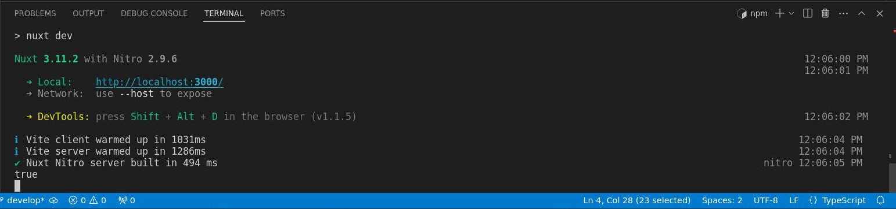
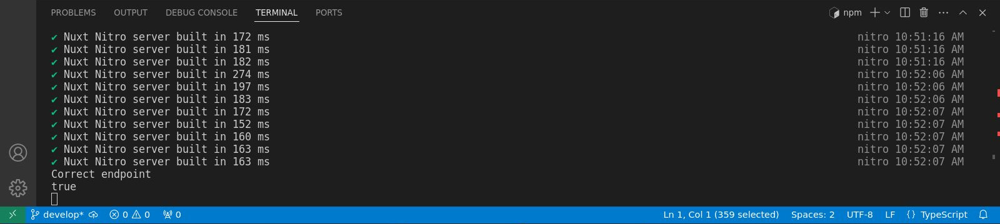
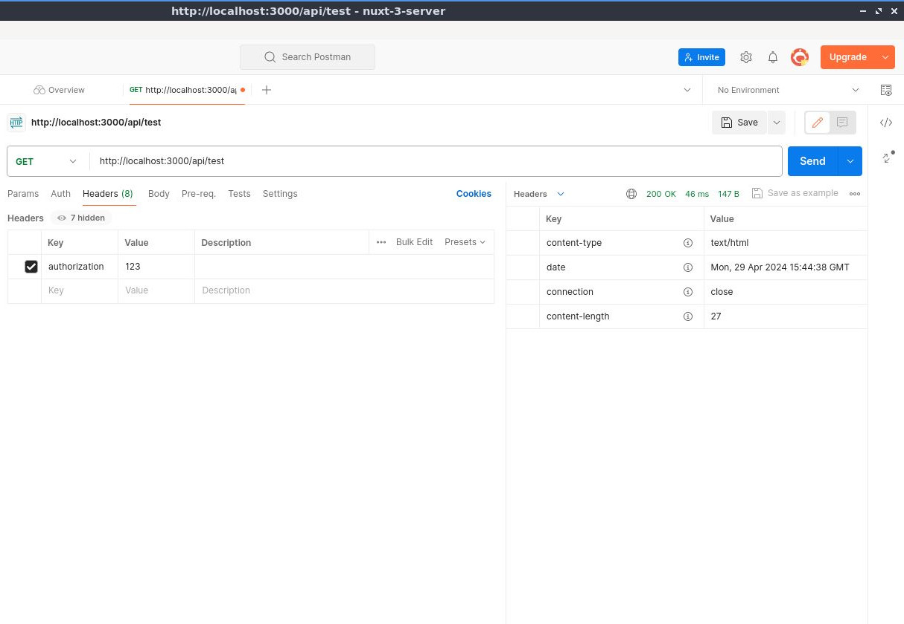
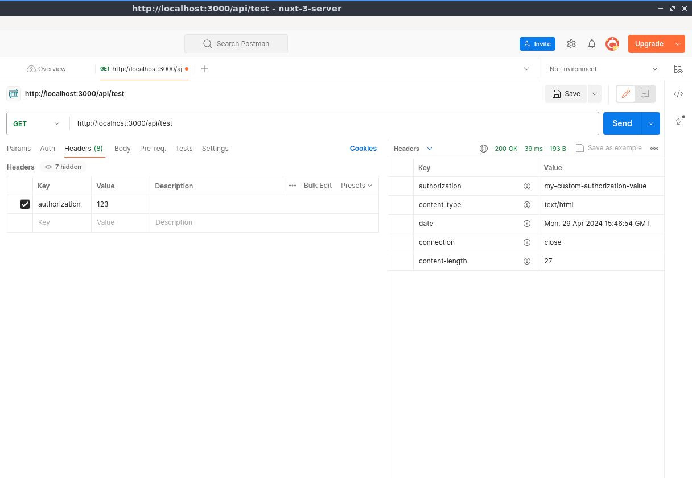

# Middleware de Servidor

>Ahora que hemos terminado de trabajar con los puntos finales de la API del servidor, exploremos el middleware del servidor.

## Conceptos básicos del middleware del servidor

Cerremos la carpeta `api/`, por ahora, y luego en la carpeta `server/` hagamos clic derecho y luego creemos una nueva carpeta. Llamémosla `middleware/`, aquí leerá automáticamente cualquier archivo dentro de esta carpeta y se leerá como un middleware de servidor.


A continuación creemos un nuevo archivo llamado `log.ts`.


Por cierto, puedes nombrar este archivo aquí como quieras. En mi caso es un `log.ts` en este ejemplo. También observe que no estamos estamos añadiendo ningún tipo de sufijo relacionado con métodos HTTP porque no lo necesitamos en el middleware.

Entonces, aquí en el archivo el mismo proceso.  Exportemos por defecto la función `defineEventHandler` pasandole `event` como parámetro y luego registrar en la cónsola `'Middleware'`.


📃`./server/middleware/log.ts`
```ts
export default defineEventHandler((event) => {
  console.log('Middleware')
})
```

Entoces abrir Postman y luego, si recuerdas, esta es [la primera `api/` que creamos](./server-api-basic-route.html). Así que devolverá el `'Hello World with GET method'`. Así que enviemos esto: `http://localhost:3000/api/test`.


Vamos a la terminal, y como podemos ver, genera el `Middleware`.


:::info Importante
El middleware se ejecutará primero antes de llegar a cualquier API. Es útil, si por ejemplo, estamos haciendo algunas validaciones o registrando cualquier solicitud o extendiendo los eventos.
:::

## Pasando a la acción

Veamos esto en acción, por ejemplo, en este mismo archivo vamos a ejecutar una validación simple de si la autorización existe. Simplemente eliminemos el cuerpo de la función y luego usaremos una [utilidad _**h3**_ que es `getRequestHeader`](https://h3.unjs.io/utils/request#getrequestheaderevent-name) y luego el primer parámetro será el `event` y luego el segundo parámetro será el valor del encabezado, que será `authorization`. Puede usar una `'A'` mayúscula o minúscula, eso funcionará igualmente. Luego registremos la consola (por ahora), entonces guárdelo.


📃`./server/middleware/log.ts`
```ts
export default defineEventHandler((event) => {
  const authorization = getRequestHeader(event, 'authorization')
  console.log(authorization)
})
```

Tenga en cuenta que no estamos haciendo ninguna validación por ahora, solo estamos registrando en la consola la `authorization`. De vuelta a Postman enviemos la API, abramos la terminal, y como se esperaba, genera el resultado `undefined`.


La razón de esto es que no especificamos la autorización, así que intentemos hacerlo. Asegúrese de que si está usando una `a` pequeña para `authorization` use una pequeña aquí también. Luego agregamos el valor que será `123` ya que este es solo un ejemplo simple.


Envíelo y generará `123`.


## Ejecutando una validación

Vamos a ejecutar una validación, de modo que si hay un valor de `authorization` está bien, si no es `undefined`. Usaremos otra [utilidad **_h3_** que es el `event.context`](https://h3.unjs.io/guide/event#eventcontext). Puedes simplemente establecer cualquier valor que desees, por lo que en este ejemplo será `authorized`. Y luego estableceremos ese valor en `true`. Puedes usar cualquier valor siempre y cuando uses el `event.context` y luego, el valor que quieres. Entonces en este ejemplo está `authorized`.


📃`./server/middleware/log.ts`
```ts
export default defineEventHandler((event) => {
  const authorization = getRequestHeader(event, 'authorization')
  if (authorization) {
    event.context.authorized = true
  } else {
    event.context.authorized = false
  }
})
```

Entonces, cierre la terminal por ahora y luego, si no hay un valor de `authorization` se establecerá el `event.context.authorized` en `false`, de lo contrario será `true`.


Luego, dado que estamos usando la API de punto final `http://localhost:3000/api/test` vamos al archivo.


Y hagamos el registro de cónsola por ahora con el `event.context.authorized`.

📃`./server/api/test.get.ts`
```ts
export default defineEventHandler((event)=>{
  console.log(event.context.authorized)
  return 'Hello World with GET method'
})
```

Luego, enviemos esto nuevamente, de vuelta a Postman para que pueda ver la API.


Pueda ver que sale `true` ya que hay un valor en nuestra variable `authorized`.


Dentro de Postman, voy a eliminar la `authorization` para que dé como resultado `false`. 


Vamos a la terminal y vemos que ahora se registra `false`.


## Arrojando un `error`

Esa es nuestra validación simple, así que, intentemos arrojar un error. 

Por ejemplo, si el `authorized` es `false`, devolvamos el error. Entonces el `statusCode` será `401` y luego un `statusMessage` que será `Unauthorized`. Así que básicamente si el `authorized` es `false` creará un error y eso arrojará un código `401` con un mensaje `Unauthorized`.

📃`./server/api/test.get.ts`
```ts
export default defineEventHandler((event)=>{
  if (!event.context.authorized) {
    return createError({statusCode:401, statusMessage: 'Unauthorized'})
  }
  return 'Hello World with GET method'
})
```

Vamos a ver eso en acción en Postman. Como puede ver, el `Headers` de `authorization` está actualmente deshabilitado, por lo que debería estar mostrando el error. Así que envíalo y, como puedes ver, dice `401 Unauthorized`.


Es posible que podrías estar preguntando si estamos haciendo una validación múltiple o repetida, así que vamos a refactorizar.

En lo adelante, en el archivo `./server/api/test.get.ts` simplemente registraremos un `console.log(event.context.authorized)` en caso de que esté autorizado.

📃`./server/api/test.get.ts`
```ts
export default defineEventHandler((event)=>{
  console.log(event.context.authorized)  
  return 'Hello World with GET method'
})
```

Y en el archivo `./server/api/middleware/log.ts` lanzaremos un error cuando `authorization` no esté definido.

📃`./server/api/middleware/log.ts`
```ts
export default defineEventHandler((event) => {
  const authorization = getRequestHeader(event, 'authorization')
  if (authorization) {
    event.context.authorized = true
  } else {
    throw createError({statusCode:401, statusMessage: 'Unauthorized'})
  }
})
```

Bastante sencillo, así que vamos a probarlo y todo debería de estar funcionando exactamente igual. Ejecutemos eso nuevamente para que el resultado esperado sea
nuevamente un error, y para que pueda ver `401 Unauthorized`.

Pero si en Postman habilitamos la `authorization` y lo enviamos.


Entonces `console.log` registra `true`.



Eso tiene sentido, así que ese es uno de los ejemplos perfectos del middleware.

## Otro ejemplo

📃`./server/api/middleware/log.ts`
```ts
export default defineEventHandler((event) => {
  const authorization = getRequestHeader(event, 'authorization')
  if (authorization) {
    event.context.authorized = true
  } else {
    throw createError({statusCode:401, statusMessage: 'Unauthorized'})
  }

  if (getRequestURL(event).pathname.includes('/api/test')){
    console.log('Correct endpoint')
  }
})
```




📃`./server/api/middleware/log.ts`
```ts
export default defineEventHandler((event) => {
  const authorization = getRequestHeader(event, 'authorization')
  if (authorization) {
    event.context.authorized = true
  } else {
    throw createError({statusCode:401, statusMessage: 'Unauthorized'})
  }

  if (getRequestURL(event).pathname.includes('/api/test')){    
    setHeader(event, 'authorization', 'my-custom-authorization-value')
  }
})
```

Intentemos con otro ejemplo, esta vez estableceremos un encabezado específico en un punto final API específico para que el middleware




31.41

es el lugar perfecto para hacer eso, así que lo que sucederá es antes de que llegue al punto final, por ejemplo, la prueba.

punto final aquí, configurará bien el encabezado, así que para hacer eso, ejecutemos el

validación primero, así que si y luego usemos otra utilidad um H3 que es la

obtener una URL, una URL de solicitud, está bien y eso será

el evento y luego será un nombre de ruta y luego seguido de incluye y

luego API y luego prueba, prueba bien, ya que vamos a validar el

Pruebe el punto final de la API, así que abra los corchetes de cierre y luego, um, registremos la consola.

eso por ahora está bien entonces um

punto final correcto, está bien, solo para verificarlo, así que regrese al cartero y luego, uh

De hecho, abramos la terminal uh y luego la limpiemos y luego enviemos y como usted

Puedo ver que genera el punto final correcto ya que estamos usando la prueba um API

punto final está bien, así que esta vez estableceremos un encabezado para que otra utilidad H3

de nuevo, así que establezca el encabezado, está bien, seguido um después de eso dentro o dentro de que es el

evento y luego um, por ejemplo, aquí, um autorización, está bien, así que estableceremos un

una autorización en el punto final de la API de prueba, está bien, entonces el valor para

ese será um, por ejemplo, mi valor de autorización personalizado, está bien, así como así

y luego, si lo ejecutamos nuevamente, eso es en realidad, seleccione los encabezados aquí

Primero, como pueden ver, tenemos aquí los encabezados básicos, pero si voy a

envíe eso y, como puede ver aquí, genera la autorización y luego el

valora bien el encabezado um, así que espero que hayas aprendido algo en el servidor um

middleware y si tiene alguna pregunta, hágamelo saber en la sección de comentarios a continuación, eso es todo.

tema y continuaremos con los complementos


28:59m


