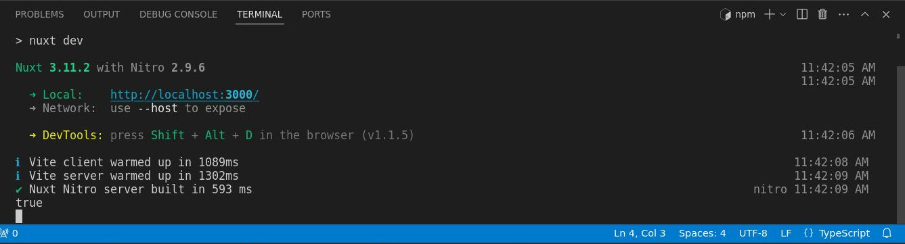

# Middleware de Servidor

>Ahora que hemos terminado de trabajar con los puntos finales de la API del servidor, exploremos el middleware del servidor.

## Conceptos básicos del middleware del servidor

Cerremos la carpeta `api/`, por ahora, y luego en la carpeta `server/` hagamos clic derecho y luego creemos una nueva carpeta. Llamémosla `middleware/`, aquí leerá automáticamente cualquier archivo dentro de esta carpeta y se leerá como un middleware de servidor.


A continuación creemos un nuevo archivo llamado `log.ts`.


Por cierto, puedes nombrar este archivo aquí como quieras. En mi caso es un `log.ts` en este ejemplo. También observe que no estamos estamos añadiendo ningún tipo de sufijo relacionado con métodos HTTP porque no lo necesitamos en el middleware.

Entonces, aquí en el archivo el mismo proceso.  Exportemos por defecto la función `defineEventHandler` pasandole `event` como parámetro y luego registrar en la cónsola `'Middleware'`.


📃`./server/middleware/log.ts`
```ts
export default defineEventHandler((event) => {
  console.log('Middleware')
})
```

Entoces abrir Postman y luego, si recuerdas, esta es [la primera `api/` que creamos](./server-api-basic-route.html). Así que devolverá el `'Hello World with GET method'`. Así que enviemos esto: `http://localhost:3000/api/test`.


Vamos a la terminal, y como podemos ver, genera el `Middleware`.


:::info Importante
El middleware se ejecutará primero antes de llegar a cualquier API. Es útil, si por ejemplo, estamos haciendo algunas validaciones o registrando cualquier solicitud o extendiendo los eventos.
:::

## Pasando a la acción

Veamos esto en acción, por ejemplo, en este mismo archivo vamos a ejecutar una validación simple de si la autorización existe. Simplemente eliminemos el cuerpo de la función y luego usaremos una [utilidad _**h3**_ que es `getRequestHeader`](https://h3.unjs.io/utils/request#getrequestheaderevent-name) y luego el primer parámetro será el `event` y luego el segundo parámetro será el valor del encabezado, que será `authorization`. Puede usar una `'A'` mayúscula o minúscula, eso funcionará igualmente. Luego registremos la consola (por ahora), entonces guárdelo.


📃`./server/middleware/log.ts`
```ts
export default defineEventHandler((event) => {
  const authorization = getRequestHeader(event, 'authorization')
  console.log(authorization)
})
```

Tenga en cuenta que no estamos haciendo ninguna validación por ahora, solo estamos registrando en la consola la `authorization`. De vuelta a Postman enviemos la API, abramos la terminal, y como se esperaba, genera el resultado `undefined`.


La razón de esto es que no especificamos la autorización, así que intentemos hacerlo. Asegúrese de que si está usando una `a` pequeña para `authorization` use una pequeña aquí también. Luego agregamos el valor que será `123` ya que este es solo un ejemplo simple.


Envíelo y generará `123`.


## Ejecutando una validación

Vamos a ejecutar una validación, de modo que si hay un valor de `authorization` está bien, si no es `undefined`. Usaremos otra [utilidad **_h3_** que es el `event.context`](https://h3.unjs.io/guide/event#eventcontext). Puedes simplemente establecer cualquier valor que desees, por lo que en este ejemplo será `authorized`. Y luego estableceremos ese valor en `true`. Puedes usar cualquier valor siempre y cuando uses el `event.context` y luego, el valor que quieres. Entonces en este ejemplo está `authorized`.


📃`./server/middleware/log.ts`
```ts
export default defineEventHandler((event) => {
  const authorization = getRequestHeader(event, 'authorization')
  if (authorization) {
    event.context.authorized = true
  } else {
    event.context.authorized = false
  }
})
```

Entonces, cierre la terminal por ahora y luego, si no hay un valor de `authorization` se establecerá el `event.context.authorized` en `false`, de lo contrario será `true`.


Luego, dado que estamos usando la API de punto final `http://localhost:3000/api/test` vamos al archivo.


Y hagamos el registro de cónsola por ahora con el `event.context.authorized`.

📃`./server/api/test.get.ts`
```ts
export default defineEventHandler((event)=>{
  console.log(event.context.authorized)
  return 'Hello World with GET method'
})
```

Luego, enviemos esto nuevamente, de vuelta a Postman para que pueda ver la API.


Pueda ver que sale `true` ya que hay un valor en nuestra variable `authorized`.



Dentro de Postman, voy a eliminar la `authorization` para que dé como resultado `false`. 


Vamos a la terminal y vemos que ahora se registra `false`.


## Arrojando un `error`

Esa es nuestra validación simple, así que, intentemos arrojar un error. 

Por ejemplo, si el `authorized` es `false`, devolvamos el error. Entonces el `statusCode` será `401` y luego un `statusMessage` que será `Unauthorized`. Así que básicamente si el `authorized` es `false` creará un error y eso arrojará un código `401` con un mensaje `Unauthorized`.

📃`./server/api/test.get.ts`
```ts
export default defineEventHandler((event)=>{
  if (!event.context.authorized) {
    return createError({statusCode:401, statusMessage: 'Unauthorized'})
  }
  return 'Hello World with GET method'
})
```

Vamos a ver eso en acción en Postman. Como puede ver, el `Headers` de `authorization` está actualmente deshabilitado, por lo que debería estar mostrando el error. Así que envíalo y, como puedes ver, dice `401 Unauthorized`.


Es posible que podrías estar preguntando si estamos haciendo una validación múltiple o repetida, así que vamos a refactorizar.

En lo adelante, en el archivo `./server/api/test.get.ts` simplemente registraremos un `console.log(event.context.authorized)` en caso de que esté autorizado.

📃`./server/api/test.get.ts`
```ts
export default defineEventHandler((event)=>{
  console.log(event.context.authorized)  
  return 'Hello World with GET method'
})
```

Y en el archivo `./server/api/middleware/log.ts` lanzaremos un error cuando `authorization` no esté definido.

📃`./server/api/middleware/log.ts`
```ts
export default defineEventHandler((event) => {
  const authorization = getRequestHeader(event, 'authorization')
  if (authorization) {
    event.context.authorized = true
  } else {
    throw createError({statusCode:401, statusMessage: 'Unauthorized'})
  }
})
```

Bastante sencillo, así que vamos a probarlo y todo debería de estar funcionando exactamente igual. Ejecutemos eso nuevamente para que el resultado esperado sea
nuevamente un error, y para que pueda ver `401 Unauthorized`.

Pero si en Postman habilitamos la `authorization` y lo enviamos.


Entonces `console.log` registra `true`.


Eso tiene sentido, así que ese es uno de los ejemplos perfectos del middleware.

## Otro ejemplo

Intentemos con otro ejemplo, esta vez estableceremos un encabezado específico en un punto final API determinado, por lo que el middleware es el lugar perfecto para hacerlo. Lo que sucederá es que antes de que llegue al punto final `/api/test` establecerá el encabezado.

Escribamos la validación primero usando otra [utilidad de h3 que es `getRequestURL`](https://h3.unjs.io/utils/request#getrequesturlevent-opts-xforwardedhost-xforwardedproto). Esta utilidad recibe la propiedad `event` y con ella verificaremos si el `pathname` incluye `'/api/test'`.

Con esto validaremos el punto final de la API de prueba. Si el `pathname` incluye `'/api/test'` entonces registraremos en la cónsola `'Correct endpoint'` solo para verificarlo.


📃`./server/api/middleware/log.ts`
```ts{9,10,11}
export default defineEventHandler((event) => {
  const authorization = getRequestHeader(event, 'authorization')
  if (authorization) {
    event.context.authorized = true
  } else {
    throw createError({statusCode:401, statusMessage: 'Unauthorized'})
  }

  if (getRequestURL(event).pathname.includes('/api/test')){
    console.log('Correct endpoint')
  }
})
```

Enviemos desde Postman el punto final `http://localhost:3000/api/test` y en el terminal aparecerá `'Correct endpoint'` ya que este punto final incluye `'/api/test'`.


Esta vez nuevamente utilizaremos otra [utilidad h3 que es `setHeader`](https://h3.unjs.io/utils/response#setheaderevent-name-value). Así que configuremos el encabezado con el parámetro `event`, luego la variable  `'authorization'` como segundo parámetro y luego el valor de la variable como tercer parámetro que será `'my-custom-authorization-value'`.


📃`./server/api/middleware/log.ts`
```ts{10}
export default defineEventHandler((event) => {
  const authorization = getRequestHeader(event, 'authorization')
  if (authorization) {
    event.context.authorized = true
  } else {
    throw createError({statusCode:401, statusMessage: 'Unauthorized'})
  }

  if (getRequestURL(event).pathname.includes('/api/test')){    
    setHeader(event, 'authorization', 'my-custom-authorization-value')
  }
})
```

Vayamos a Postman y seleccionemo para ver los _**Headers**_ básicos de la respuesta.


Pero si repetimos la solicitud podemos ver entonces la variable `authorization` con el valor `'my-custom-authorization-value'` en los encabezados.


Así que espero que hayas aprendido algo en el middleware del servidor. Esto es todo el tema sobre los middleware y a continuación continuaremos con los complementos.


