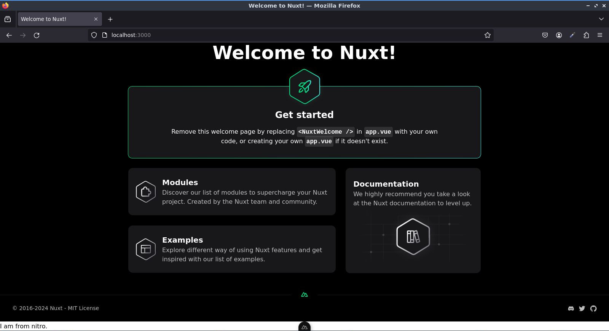

# Complementos del Servidor Nitro

>Aprenda los conceptos básicos de los complementos de servidor y los ganchos nitro

Ahora que hemos terminado con el middleware del servidor, podemos comenzar a trabajar en los complementos. Así que cerremos la carpeta `middleware` por ahora.

Haga clic derecho en la carpeta `server` y luego cree una nueva carpeta y asígnele el nombre `plugins`.

Todo lo que esté dentro de la carpeta `plugins` será registrados como complementos de Nitro. Esto nos permite extender el tiempo de ejecución de Nitro y
conectarnos al ciclo de vida.


:::info 쯈ué es Nitro?
Nitro es un paquete independiente que puedes usar como servidor web y también es usado por las personas que están detrás de Nuxt.  Es un framework de código abierto desarrollado en Javascript con TypeScript para construir servidores web ultrarrápidos. Puedes usarlo con o sin Nuxt. [Si quiere aprender más sobre **Nitro**, consulte su sitio web](https://nitro.unjs.io/). 
:::

>En Nuxt, cualquier cosa dentro de la carpeta `server` está impulsada por Nitro. Si quieres saber la diferencia entre Nuxt y Nitro, se recomienda el canal de [Alexander Leer](https://www.youtube.com/channel/UCVJ5qp8Vw8gXQ9RkuNdYWMw), busque [Nuxt vs. Nitro](https://www.youtube.com/watch?v=DkvgJa-X31k).


De vuelta al código, dentro de la carpeta `plugins`, cree un nuevo archivo llamado `test.ts`.


Luego dentro del archivo, exportemos de manera predeterminada la definición del complemento Nitro, quien recive un parametro `nitroApp` y luego hagámosle un `console.log`.


📃`./server/plugins/test.ts`
```ts
export default defineNitroPlugin((nitroApp)=>{
  console.log('Nitro', nitroApp)
})
```

La consola registrará `nitroApp`. Entonces, vayamos a la terminal para que pueda ver que genera los ganchos disponibles: la aplicación H3, el enrutador y algún otro como una llamada local, recuperación local, error de captura, etc.


Así que probaremos algunos ejemplos y usaremos un gancho disponible dentro del Nitro. Para hacer eso, simplemente comente el registro de la consola. Usemos el objeto `nitroApp` seguido de `hooks`, luego `hook` sin la "s". Estos son algunos de los ganchos disponibles dentro del Nitro.


Esta vez usaremos `'render:html'`, le pasaremos `html` con `{event}`. Y luego, registraremos algo en la consola.

También agregaremos un contenido dentro del cuerpo para que se muestre en el momento en que se renderiza el HTML.

El `h1`, será nuestra etiqueta con el contenido `I am from nitro`.


📃`./server/plugins/test.ts`
```ts
export default defineNitroPlugin((nitroApp)=>{
  // console.log('Nitro', nitroApp)
  nitroApp.hooks.hook('render:html', (html, {event})=>{
    console.log('HTML Rendered.')
    html.bodyAppend.push('<h1>I am from nitro.</h1>')
  })
})
```

Probemos eso dentro de la terminal. Pero antes, deshabilitemos el error que arrojamos, asegurándonos de no arrojar ningún error.

📃`./server/middleware/log.ts`
```ts{6}
export default defineEventHandler((event) => {
  const authorization = getRequestHeader(event, 'authorization')
  if (authorization) {
    event.context.authorized = true
  } else {
    // throw createError({statusCode:401, statusMessage: 'Unauthorized'})
  }

  if (getRequestURL(event).pathname.includes('/api/test')){
    console.log('Correct endpoint')
    setHeader(event, 'authorization', 'my-custom-authorization-value')
  }
})
```

Luego en la terminal, reinicie la aplicación y observará que se registra en la cónsola `HTML Rendered.`.


Luego abra el navegador y si lo actualiza, debería mostrar la siguiente bienvenida,




Si te desplazas hacia abajo como puedes ver, dice `I am from nitro.`, que fue el contenido que creamos.

Por ahora, comentemos temporalmente la siguiente bienvenida y guarde. 

📃`./app.vue`
```vue
<template>
  <div>
    <!--NuxtWelcome /-->
  </div>
</template>
```

Luego, como puede ver, sale el `I am from nitro.` con mas claridad.


Inspeccione eso y eso está dentro del cuerpo y tiene una etiqueta `h1`. 


Así que si desea manipular el renderizado HTML, puedes usar el gancho `render:html`.

---

Ahora que sabemos cómo manipular el HTML renderizado usando el gancho Nitro. Esta vez rastrearemos el agente de usuario.

Así que nuevamente el mismo proceso con el gancho `nitroApp.hooks.hook`, pero esta vez en lugar de renderizar HTML será renderizar la respuesta. Le pasamos el evento
y simplemente una cónsola que registra el evento para que podamos ver qué hay dentro del evento.


📃`./server/plugins/test.ts`
```ts{8,9,10}
export default defineNitroPlugin((nitroApp)=>{
  // console.log('Nitro', nitroApp)
  nitroApp.hooks.hook('render:html', (html, {event})=>{
    // console.log('HTML Rendered.')
    html.bodyAppend.push('<h1>I am from nitro.</h1>')
  })

  nitroApp.hooks.hook('render:response', (response, {event})=>{
    console.log(event)
  })
})
```

De vuelta en la terminal, actualice y como puede ver, tenemos aquí el evento disponible.


Hay un objeto `node` con las propiedades `req` y `res`. Si baja un poco, también está el método de contexto web.

De vuelta al código, dejemos el registro de la consola con el evento.

Ahora registremos específicamente el agente de usuario de los encabezados de la petición del nodo.  

📃`./server/plugins/test.ts`
```ts{9}
export default defineNitroPlugin((nitroApp)=>{
  // console.log('Nitro', nitroApp)
  nitroApp.hooks.hook('render:html', (html, {event})=>{
    // console.log('HTML Rendered.')
    html.bodyAppend.push('<h1>I am from nitro.</h1>')
  })

  nitroApp.hooks.hook('render:response', (response, {event})=>{
    console.log(event.node.req.headers['user-agent'])
  })
})
```


Actualice nuevamente el navegador y abra la terminal 


Como puede ver, sale el agente de usuario.

---

Ahora que sabemos cómo usar los ganchos básicos de Nitro, esta vez haremos un ejemplo para los usuarios de `mongoDB`.

Por ejemplo, desea conectar su base de datos `mongoDB` en su aplicación Nuxt. Para poder hacer esto, será algo como esto.

Primero importamos `mongoose`, pero tenga en cuenta que debe tener previamente instalado este paquete para que no le cause un error.

Luego dentro de la definición del complemento de Nitro, usaremos el gancho de conección de `mongoose`, al cual le pasaremos la configuración `MONGO_URI` en tiempo de ejecución. Por lo que debe configurarlo dentro del `runtimeConfig` de la definición de configuración de Nuxt.

Después de eso, simplemente registremos en la consola para verificar si la conexión `mongoDB` es exitosa.

📃`./server/plugins/test.ts`
```ts{14,15}
import mongoose from 'mongoose'

export default defineNitroPlugin((nitroApp)=>{
  // console.log('Nitro', nitroApp)
  nitroApp.hooks.hook('render:html', (html, {event})=>{
    // console.log('HTML Rendered.')
    html.bodyAppend.push('<h1>I am from nitro.</h1>')
  })

  nitroApp.hooks.hook('render:response', (response, {event})=>{
    console.log(event.node.req.headers['user-agent'])
  })

  mongoose.connect(useRuntimeConfig().MONGO_URI)
  console.log('Connected to mongoDB.')
})
```

Si el registro de la consola no aparece, eso significa que hay un problema con tu conexión.

---

Bien, eso es todo por el tema de complementos del servidor y espero que aprendas algo en este tutorial.

Entonces, [si quieres aprender más sobre complementos en Nitro, puedes ir a su sitio web](https://nitro.unjs.io/guide/plugins).

Consulte tambien aqui para mas informacion.

- https://nuxt.com/docs/guide/going-further/hooks
- https://nuxt.com/docs/guide/going-further/hooks#server-hooks-runtime
- https://nuxt.com/docs/api/advanced/hooks#nitro-app-hooks-runtime-server-side

41:34